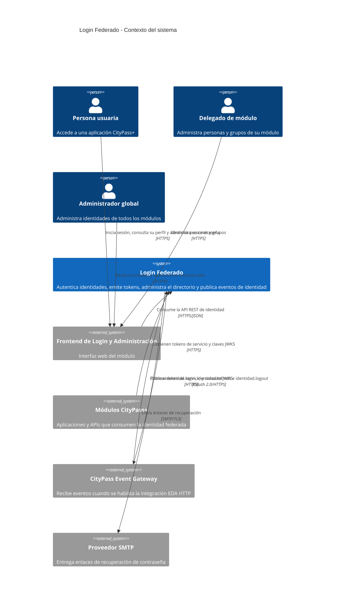

# C4 — Contexto del sistema (nivel 1)

**Sistema de interés:** Módulo de Login Federado e Identidad de CityPass+
**Fecha de revisión:** 24 de septiembre de 2026

El nivel de contexto presenta personas y sistemas externos directamente relacionados con Login Federado. Los detalles de tecnología, almacenamiento y despliegue se reservan para los niveles siguientes.

## Responsabilidad y límites

- Login Federado centraliza autenticación humana, sesiones renovables, identidad de servicios, perfil y administración del directorio.
- Los módulos consumidores validan JWT localmente mediante JWKS; no consultan al IdP en cada request.
- La lógica de movilidad, residuos, reclamos, emergencias, espacios, analítica y EDA queda fuera del sistema de interés.
- OpenLDAP, PostgreSQL y detección de anomalías son contenedores internos del módulo y se muestran en el nivel 2, no como sistemas externos de este contexto.
- La publicación EDA funciona en modo `logging` por defecto. La relación con el gateway solo se materializa al configurar `EDA_PUBLISHER=http` y las variables `EDA_*`.

## Correspondencia con C4

El alcance es un único sistema de software. Todos los elementos externos son personas o sistemas directamente conectados al sistema de interés; la infraestructura se representa exclusivamente en los diagramas de despliegue.
