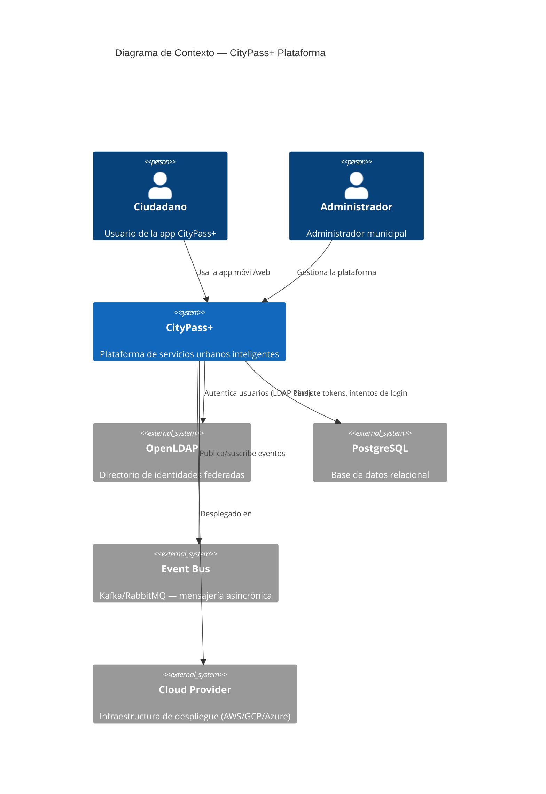

# C4 Context Diagram — CityPass+ (Nivel 1)

## Descripción

Este diagrama muestra CityPass+ como sistema central que interactúa con:
- **Ciudadanos y administradores** como usuarios humanos
- **OpenLDAP** como fuente de verdad de identidades
- **PostgreSQL** para persistencia de tokens y auditoría
- **Event Bus** para comunicación asincrónica con otros módulos
- **Cloud Provider** como infraestructura de ejecución
