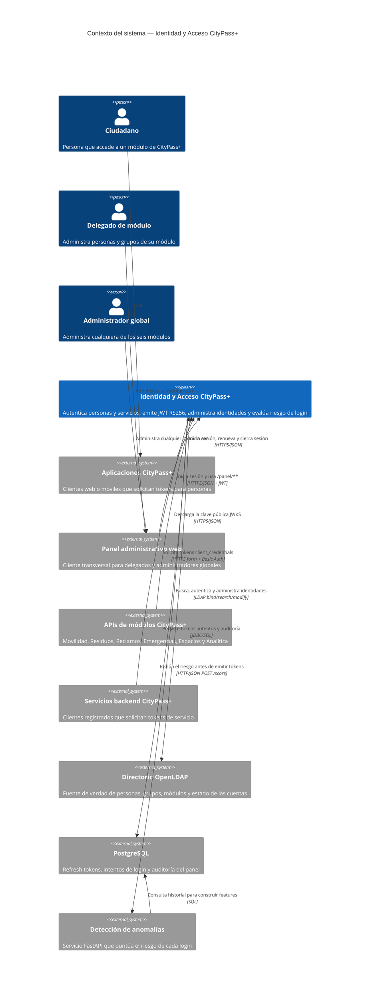

# C4 — Contexto del sistema de Identidad y Acceso CityPass+ (Nivel 1)

**Estado representado:** AS-IS del repositorio backend.

**Alcance:** autenticación de personas y servicios, administración del directorio y evaluación de riesgo.

**Fuera de alcance:** despliegue cloud y Event Bus futuro; se documentan por separado.

## Leyenda

- **Persona:** rol humano que usa CityPass+.
- **Sistema:** software dentro del alcance de este repositorio.
- **Sistema externo:** cliente o dependencia con una responsabilidad independiente.
- Las flechas indican una dependencia unidireccional y especifican el protocolo cuando corresponde.

## Aclaraciones de alcance

- Las APIs de los seis módulos son consumidores del servicio de identidad, no contenedores implementados en este repositorio.
- El Event Bus no aparece en el estado actual porque `LoggingEventPublisher` solo escribe eventos en el log. Cuando exista un broker real debe incorporarse en una vista TO-BE separada.
- Oracle Cloud, GHCR, Supabase y las VMs pertenecen a los diagramas de despliegue, no al contexto funcional.
