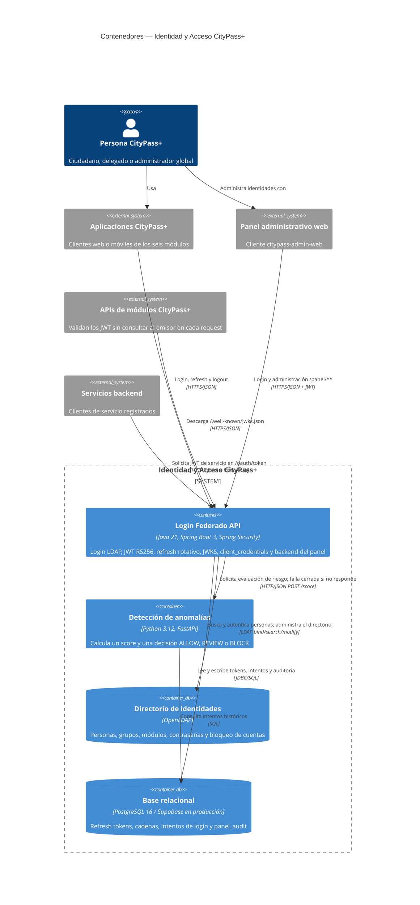

# C4 — Contenedores de Identidad y Acceso CityPass+ (Nivel 2)

**Estado representado:** AS-IS.

**Sistema en foco:** Identidad y Acceso CityPass+.

## Responsabilidades y límites

- `Login Federado API` es el único emisor de JWT de este sistema.
- Las APIs consumidoras descargan JWKS y validan localmente firma, expiración, issuer, audience y contrato de claims.
- `anomaly-detection` es obligatorio para el login humano: un error de red o del servicio produce un 401 genérico.
- OpenLDAP es la fuente de verdad de identidad y autorización por grupos; PostgreSQL no reemplaza al directorio.
- El contenedor one-shot `ldap-config` es operacional y se muestra en los diagramas de despliegue.
- No existe actualmente un contenedor Kafka/RabbitMQ. Los eventos se serializan en el log mediante `LoggingEventPublisher`.

## Leyenda

- **Container:** aplicación ejecutable desplegable de forma independiente.
- **ContainerDb:** almacén de datos utilizado por el sistema.
- **System_Ext:** consumidor fuera de la frontera de Identidad y Acceso.
- Cada relación entre procesos indica el protocolo o formato utilizado.
