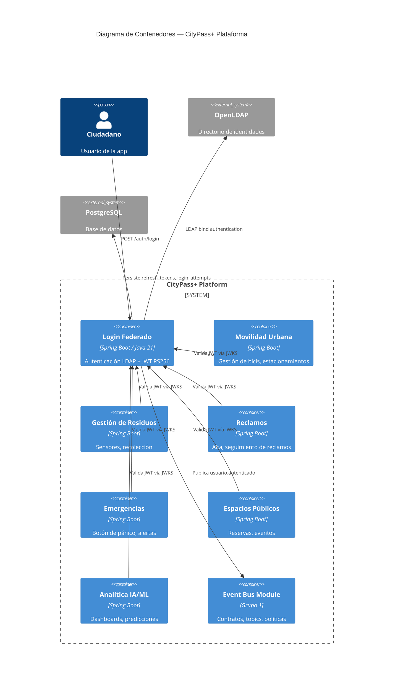

# C4 Container Diagram — CityPass+ (Nivel 2)

## Descripción

El módulo **Login Federado** es el único punto de autenticación para toda la plataforma. Los otros 6 módulos validan JWTs offline descargando la clave pública del endpoint `/.well-known/jwks.json` — no necesitan llamar a este servicio en cada request.
