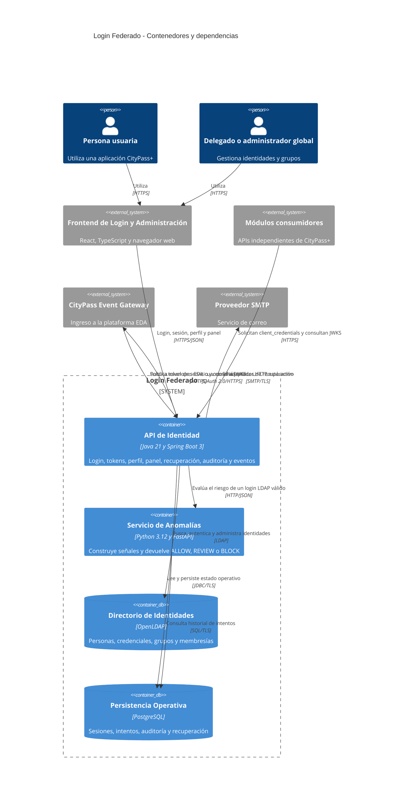

# C4 — Contenedores (nivel 2)

**Sistema de interés:** Módulo de Login Federado e Identidad de CityPass+
**Fecha de revisión:** 24 de septiembre de 2026

En C4, un contenedor es una aplicación o almacén de datos ejecutable de manera independiente. Este diagrama representa la arquitectura lógica de ejecución y no una topología cloud específica.

## Decisiones y límites

- OpenLDAP es la fuente de verdad de identidades, credenciales, estado de cuenta y membresías.
- PostgreSQL conserva refresh tokens, intentos, auditoría y tokens o solicitudes de recuperación; no almacena contraseñas.
- El servicio FastAPI consulta `login_attempts` y es una dependencia sincrónica del login. La API aplica fallo cerrado cuando no puede evaluarse el riesgo.
- La imagen runtime de anomalías busca `anomaly-detection/models/isolation_forest.pkl`. El artefacto experimental está en `anomaly-detection/ML/models/`, por lo que el runtime desplegado utiliza reglas mientras no exista un modelo en la ruta empaquetada.
- El pipeline `anomaly-detection/ML` es una capacidad de desarrollo offline, no un contenedor runtime; se representa en la vista de desarrollo 4+1.
- La topología, las réplicas, los volúmenes y los nodos cloud se documentan en los diagramas de despliegue 12 y 13.
