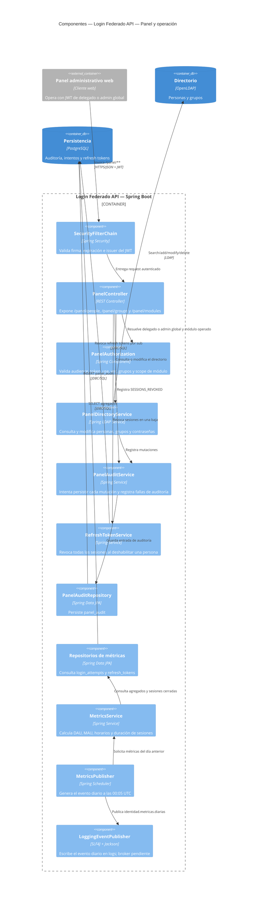

# C4 — Componentes de Login Federado API (Nivel 3)

**Estado representado:** AS-IS.

**Contenedor en foco:** aplicación Spring Boot `login-federado`.

El contenedor se divide en dos diagramas para mantener legibilidad: autenticación/tokens y panel/operación.

## Autenticación y tokens

```mermaid
C4Component
    title Componentes — Login Federado API — Autenticación y tokens

    Container_Ext(clientApps, "Clientes humanos", "Web/móvil", "Solicitan login, refresh y logout")
    Container_Ext(serviceClients, "Clientes de servicio", "Backends", "Solicitan tokens client_credentials")
    Container_Ext(platformApis, "APIs consumidoras", "Servicios CityPass+", "Descargan JWKS")
    Container(anomalyApi, "Detección de anomalías", "Python/FastAPI", "Evalúa riesgo de login")
    ContainerDb(openldap, "Directorio", "OpenLDAP", "Identidades y grupos")
    ContainerDb(postgres, "Persistencia", "PostgreSQL", "Tokens, intentos y auditoría")

    Container_Boundary(login, "Login Federado API — Spring Boot") {
        Component(security, "SecurityConfig / SecurityFilterChain", "Spring Security", "Declara endpoints públicos y valida JWT en endpoints protegidos")
        Component(authCtrl, "AuthController", "REST Controller", "Expone /auth/login, /auth/refresh y /auth/logout")
        Component(oauthCtrl, "OAuthTokenController", "REST Controller", "Expone /oauth/token para client_credentials")
        Component(jwksCtrl, "JwksController", "REST Controller", "Expone /.well-known/jwks.json")

        Component(authSvc, "AuthService", "Spring Service", "Orquesta login, refresh y logout")
        Component(clientRegistry, "ClientRegistry", "Spring Component", "Valida clientes humanos y de servicio, audience y módulo")
        Component(ldapDirectory, "LdapDirectory", "Spring LDAP Service", "Busca, relee y autentica personas mediante bind")
        Component(loginAttempts, "LoginAttemptService", "Spring Service", "Aplica la ventana deslizante anti fuerza bruta")
        Component(anomalyClient, "AnomalyRiskClient", "Spring RestClient", "Consulta /score con timeouts y política fail-closed")
        Component(tokenIssuer, "AccessTokenIssuer", "Nimbus JOSE + Spring Security", "Construye y firma JWT humanos y de servicio")
        Component(refreshTokens, "RefreshTokenService", "Spring Service", "Emite, rota, detecta reuso y revoca refresh tokens")
        Component(jwtKeys, "JwtKeyConfig / RSAKey", "Nimbus JOSE", "Carga o genera claves RSA y provee encoder, decoder y kid")
        Component(authRepos, "Repositorios de autenticación", "Spring Data JPA", "RefreshTokenRepository y LoginAttemptRepository")
        Component(events, "EventPublisher / LoggingEventPublisher", "SLF4J + Jackson", "Serializa eventos en el log; broker pendiente")
    }

    Rel(clientApps, security, "Invoca endpoints de autenticación", "HTTPS/JSON")
    Rel(security, authCtrl, "Permite /auth/** sin sesión")
    Rel(authCtrl, authSvc, "Delega login, refresh y logout")

    Rel(serviceClients, security, "Invoca /oauth/token", "HTTPS form + Basic Auth")
    Rel(security, oauthCtrl, "Permite /oauth/**")
    Rel(oauthCtrl, clientRegistry, "Autentica client_id y client_secret")
    Rel(oauthCtrl, tokenIssuer, "Emite JWT de servicio")

    Rel(platformApis, security, "Solicita JWKS", "HTTPS")
    Rel(security, jwksCtrl, "Permite /.well-known/**")
    Rel(jwksCtrl, jwtKeys, "Obtiene solo la clave pública")

    Rel(authSvc, clientRegistry, "Valida cliente y módulo")
    Rel(authSvc, loginAttempts, "Verifica y registra intentos")
    Rel(authSvc, ldapDirectory, "Busca, autentica y relee la persona")
    Rel(authSvc, anomalyClient, "Evalúa riesgo de login")
    Rel(authSvc, tokenIssuer, "Solicita access token")
    Rel(authSvc, refreshTokens, "Emite, rota o revoca refresh token")
    Rel(authSvc, events, "Publica usuario.autenticado")

    Rel(ldapDirectory, openldap, "Search y bind", "LDAP")
    Rel(anomalyClient, anomalyApi, "POST /score", "HTTP/JSON")
    Rel(tokenIssuer, jwtKeys, "Firma con la clave RSA privada")
    Rel(refreshTokens, ldapDirectory, "Revalida cuenta y grupos en cada canje")
    Rel(refreshTokens, clientRegistry, "Revalida cliente, audience y módulo")
    Rel(refreshTokens, authRepos, "Persiste y revoca cadenas")
    Rel(loginAttempts, authRepos, "Cuenta y registra intentos")
    Rel(authRepos, postgres, "CRUD", "JDBC/SQL")
```



## Panel, administración y métricas



## Paquetes actuales

```text
citypass.loginfederado
├── config/       Security, LDAP, JWT, clientes, panel y OpenAPI
├── controller/   AuthController, OAuthTokenController, JwksController
├── identity/     LdapDirectory, LdapDirectoryPerson, ClientRegistry
├── token/        AccessTokenIssuer
├── service/      AuthService, RefreshTokenService, LoginAttemptService
├── security/     AnomalyRiskClient
├── panel/        Controller, autorización, directorio, auditoría y DTOs
├── metrics/      Job programado, agregación y evento diario
├── repository/   Repositorios JPA de tokens, intentos, métricas y auditoría
├── model/        RefreshToken y LoginAttempt
├── event/        Contrato y placeholder de publicación
├── dto/          Contratos HTTP de autenticación y anomalías
└── exception/    Errores y respuestas HTTP centralizadas
```

## Leyenda

- **Component:** unidad con responsabilidad y API interna concreta dentro de `login-federado`.
- **Container/ContainerDb:** proceso o almacén externo al contenedor Spring Boot.
- `LoggingEventPublisher` describe el estado actual; Kafka/RabbitMQ sigue siendo una decisión futura.
