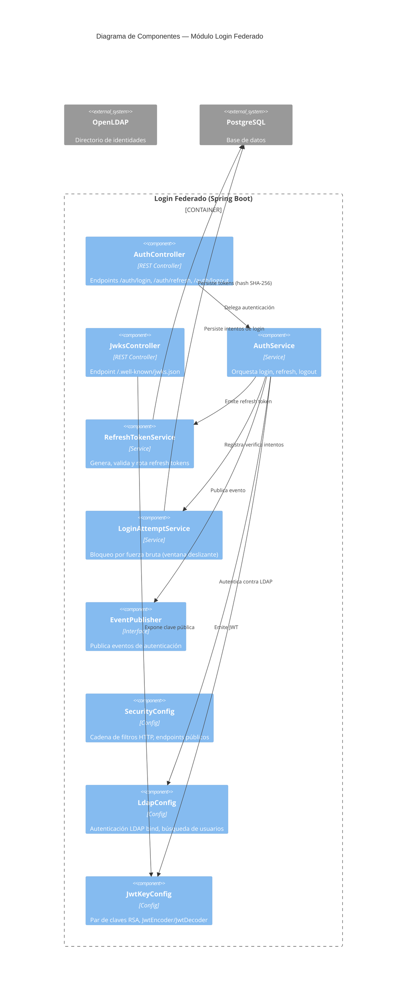

# C4 Component Diagram — Login Federado (Nivel 3)



## Paquetes del proyecto

```
citypass.loginfederado
├── controller/     → AuthController, JwksController
├── service/        → AuthService, RefreshTokenService, LoginAttemptService
├── security/       → LdapUserPrincipal, CustomLdapUserDetailsMapper
├── config/         → SecurityConfig, LdapConfig, JwtKeyConfig, JwtProperties
├── repository/     → RefreshTokenRepository, LoginAttemptRepository
├── model/          → RefreshToken, LoginAttempt (JPA entities)
├── dto/            → LoginRequest, LoginResponse, RefreshRequest
├── event/          → EventPublisher, LoggingEventPublisher, UsuarioAutenticadoEvent
└── exception/      → AccountLockedException, GlobalExceptionHandler
```
