# C4 — Componentes de la API de Identidad (nivel 3)

**Contenedor en alcance:** API de Identidad Spring Boot
**Fecha de revisión:** 24 de septiembre de 2026

Este nivel descompone únicamente el contenedor Spring Boot. OpenLDAP, PostgreSQL, FastAPI y los servicios externos aparecen como dependencias de sus componentes.

```mermaid
C4Component
    title API de Identidad - Componentes principales

    Container_Boundary(api, "API de Identidad - Spring Boot") {
        Component(authApi, "API de Autenticación y Perfil", "AuthController y ProfileController", "Login, refresh, logout, perfil y contraseñas")
        Component(oauthApi, "API OAuth", "OAuthTokenController", "Emite tokens de servicio")
        Component(jwksHealthApi, "API JWKS y Salud", "JwksController, HealthController y Actuator", "Publica claves y estado operativo")
        Component(panelApi, "API de Administración", "PanelController", "Personas, grupos, lotes y vistas globales")

        Component(authService, "Orquestación de Autenticación", "AuthService y LoginAttemptService", "Aplica lockout, LDAP, riesgo, tokens y eventos")
        Component(sessionService, "Gestión de Sesiones", "RefreshTokenService", "Emisión, rotación, reuso y revocación")
        Component(passwordService, "Gestión de Contraseñas", "PasswordService y limitadores", "Recuperación, cambio y revocación")
        Component(panelServices, "Servicios del Panel", "PanelPersonService, PanelGroupService y PanelAccountService", "Reglas y operaciones administrativas")
        Component(panelAuth, "Autorización del Panel", "PanelAuthorization", "Valida audience, tipo, versión, rol y módulo")

        Component(identity, "Adaptador de Identidad", "LdapDirectory y ClientRegistry", "Directorio y registro de clientes")
        Component(token, "JWT y Claves RSA", "AccessTokenIssuer y JwtKeyConfig", "Firma tokens humanos y de servicio; publica clave")
        Component(riskClient, "Cliente de Riesgo", "AnomalyRiskClient", "Invoca POST /score con timeout y fallo cerrado")
        Component(eventPort, "Puerto de Eventos", "EventPublisher", "Abstrae la publicación de hechos de identidad")
        Component(eventAdapters, "Adaptadores de Eventos", "LoggingEventPublisher y EdaHttpEventPublisher", "Registra localmente o publica envelopes HTTP")
        Component(repositories, "Repositorios Operativos", "Spring Data JPA", "Sesiones, intentos, auditoría y recuperación")
    }

    ContainerDb(ldap, "OpenLDAP", "Directorio de identidades")
    ContainerDb(db, "PostgreSQL", "Persistencia operativa")
    Container(risk, "Servicio de Anomalías", "FastAPI", "Evaluación de riesgo")
    System_Ext(gateway, "CityPass Event Gateway", "Plataforma EDA")
    System_Ext(mail, "Proveedor SMTP", "Correo de recuperación")

    Rel(authApi, authService, "Delega login, refresh y logout")
    Rel(authApi, passwordService, "Delega perfil y contraseñas")
    Rel(oauthApi, token, "Emite token de servicio")
    Rel(jwksHealthApi, token, "Obtiene material público de la clave")
    Rel(panelApi, panelAuth, "Autoriza actor y alcance")
    Rel(panelApi, panelServices, "Ejecuta operaciones administrativas")

    Rel(authService, identity, "Busca y autentica")
    Rel(authService, riskClient, "Solicita evaluación")
    Rel(authService, token, "Emite access token")
    Rel(authService, sessionService, "Emite o rota refresh token")
    Rel(authService, eventPort, "Publica login y refresh")
    Rel(sessionService, eventPort, "Publica logout")
    Rel(passwordService, identity, "Revalida identidad")
    Rel(passwordService, panelServices, "Actualiza contraseña LDAP")
    Rel(passwordService, sessionService, "Revoca sesiones")
    Rel(passwordService, mail, "Envía enlace", "SMTP")
    Rel(panelServices, identity, "Administra el directorio")
    Rel(panelServices, repositories, "Registra auditoría")
    Rel(panelServices, sessionService, "Revoca sesiones al deshabilitar")

    Rel(authService, repositories, "Registra intentos")
    Rel(sessionService, repositories, "Administra cadenas")
    Rel(passwordService, repositories, "Administra recuperación")
    Rel(identity, ldap, "Lee, autentica y modifica", "LDAP")
    Rel(repositories, db, "Lee y escribe", "JDBC")
    Rel(riskClient, risk, "Evalúa", "HTTP/JSON")
    Rel(eventAdapters, eventPort, "Implementan")
    Rel(eventAdapters, oauthApi, "Obtiene token grupo2 en modo HTTP")
    Rel(eventAdapters, gateway, "Publica evento en modo HTTP", "HTTPS/JSON")
```

## Paquetes representados

| Paquete | Responsabilidad principal |
| --- | --- |
| `controller` | Contratos REST de autenticación, OAuth, JWKS y perfil |
| `service` | Casos de uso de autenticación, sesión y contraseñas |
| `panel` | Administración, autorización, reglas y auditoría |
| `identity` | Acceso a LDAP y registro de clientes |
| `token` | Construcción y firma de JWT |
| `security` | Integración con la evaluación de riesgo |
| `event` | Puerto, envelopes y adaptadores EDA |
| `metrics` | Modelo de hechos crudos de login, refresh y logout |
| `repository` y `model` | Persistencia PostgreSQL |
| `config` | Seguridad, LDAP, JWT, panel, contraseñas y EDA |

## Alcance y simplificaciones

- Los componentes agrupan clases con una responsabilidad común; no equivalen uno a uno a cada clase Java.
- El pipeline experimental `anomaly-detection/ML` no pertenece al contenedor Spring Boot y se excluye de este nivel.
- El adaptador de logging es el modo predeterminado. El adaptador HTTP se activa por configuración y su envío es sincrónico.
