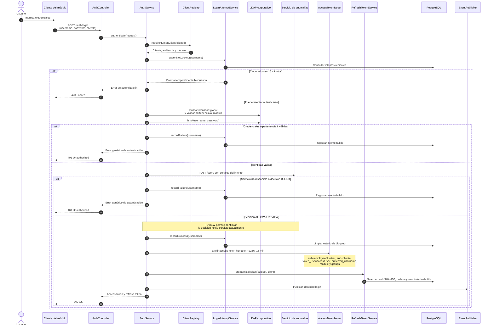

# Secuencia — Inicio de sesión federado

**Fecha de revisión:** 24 de septiembre de 2026
**Endpoint:** `POST /auth/login`

El inicio de sesión humano exige `username`, `password` y `clientId`. La respuesta de error no revela si falló el usuario, la contraseña, la pertenencia al módulo o la evaluación de riesgo.

## Consideraciones técnicas

- El límite de bloqueo se evalúa por identidad: cinco fallos dentro de una ventana de quince minutos.
- La evaluación de anomalías es obligatoria y opera en modo *fail closed*: una indisponibilidad impide el acceso.
- El refresh token se almacena únicamente mediante su hash SHA-256; el valor en claro sólo se entrega al cliente.
- La publicación de `identidad.login` usa el publicador configurado. En el modo HTTP es sincrónica, por lo que un fallo del gateway puede ocurrir después de haber persistido el estado de autenticación.
