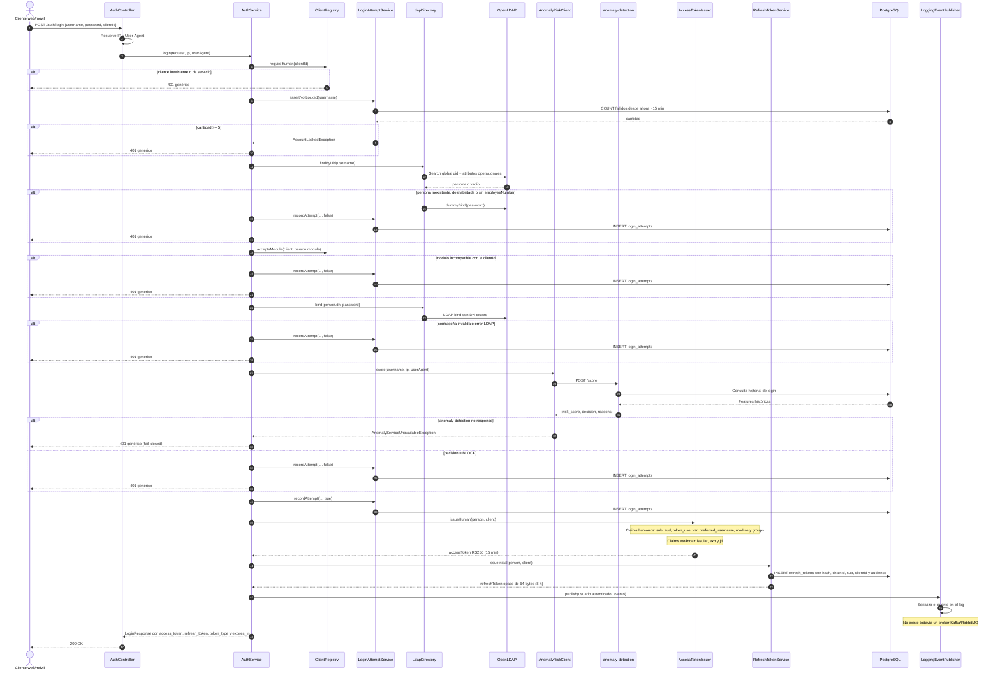

# Secuencia — Login humano

**Estado representado:** AS-IS del endpoint `POST /auth/login`.

## Reglas reflejadas

1. El `clientId` es obligatorio y limita el módulo y la audience del JWT.
2. Toda falla de autenticación, lockout o anomalías devuelve el mismo 401 para evitar enumeración.
3. La evaluación de anomalías ocurre después de un bind LDAP exitoso y antes de emitir tokens.
4. El access token dura 15 minutos; el refresh token dura 8 horas y solo se almacena hasheado.
5. La publicación de eventos es actualmente un placeholder basado en logs.
