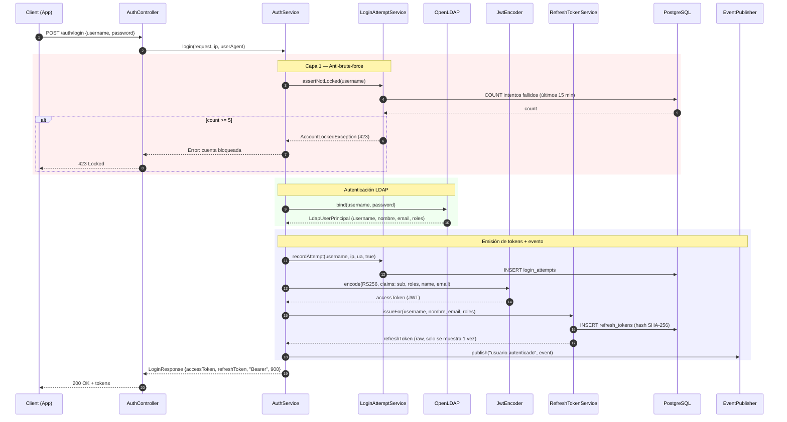

# Sequence Diagram — Flujo de Login

## Resumen

1. **Anti-brute-force**: Se verifica antes de tocar LDAP (capa de protección barata)
2. **LDAP bind**: Autenticación real contra el directorio
3. **JWT RS256**: Access token de 15 min con claims custom (roles, name, email)
4. **Refresh token**: Token opaco de 64 bytes, solo se almacena su hash SHA-256 (7 días)
5. **Evento**: Se publica `usuario.autenticado` para el bus de eventos
