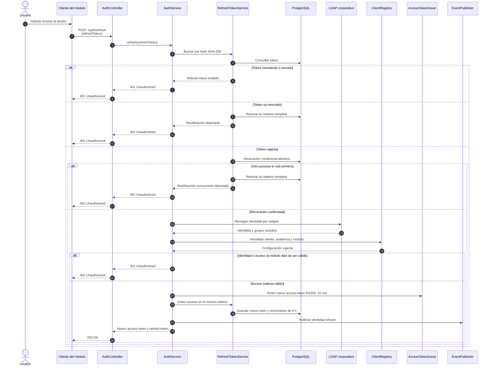

# Secuencia — Rotación del refresh token

**Fecha de revisión:** 24 de septiembre de 2026
**Endpoint:** `POST /auth/refresh`

Cada uso válido rota el refresh token. La reutilización, incluida una carrera concurrente, invalida la cadena completa de la sesión.

## Garantías

- La rotación condicional evita que dos solicitudes válidas consuman el mismo token simultáneamente.
- La detección de reutilización revoca la cadena de refresh tokens, no sólo el token presentado.
- Antes de renovar, se consulta nuevamente LDAP y se comprueba que la audiencia y el módulo continúen habilitados.
- Un access token emitido previamente no se revoca en línea; conserva validez hasta su expiración de quince minutos.
