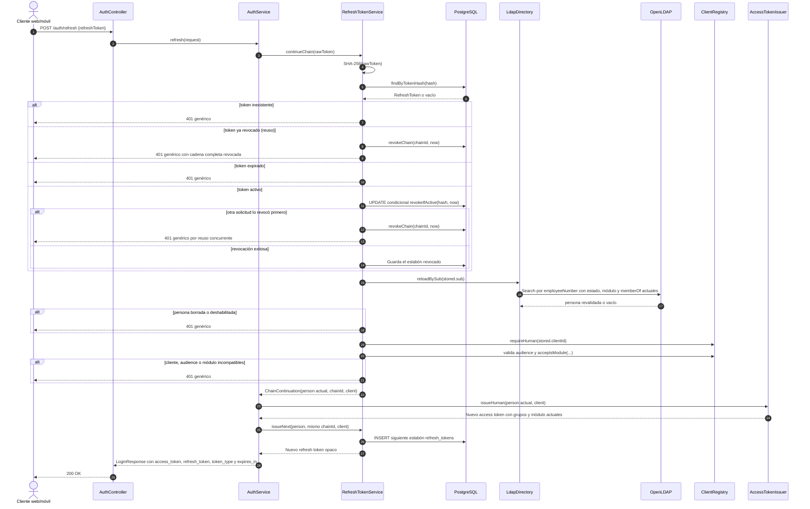

# Secuencia — Rotación de refresh token

**Estado representado:** AS-IS del endpoint `POST /auth/refresh`.

## Reglas reflejadas

1. Cada refresh token válido se usa una sola vez.
2. El reuso, incluido el canje concurrente, revoca toda la cadena como señal de posible robo.
3. La cuenta, los grupos y el módulo se releen desde LDAP en cada canje.
4. Los claims no se copian del token anterior: se emiten con el estado actual del directorio.
5. El siguiente refresh token conserva el `chainId`, `clientId` y audience de la sesión.
