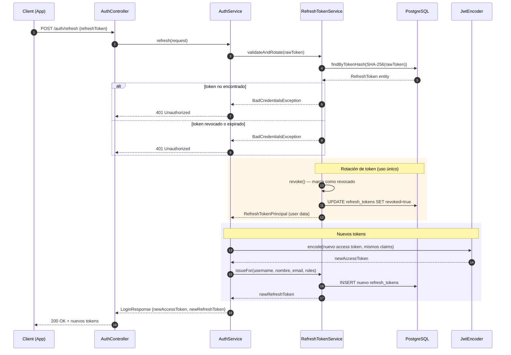

# Sequence Diagram — Flujo de Refresh Token

## Resumen

1. **Validación**: Se busca el hash del token en PostgreSQL
2. **Rotación**: El token viejo se revoca INMEDIATAMENTE (uso único)
3. **Nuevos tokens**: Se emite un nuevo access token + un nuevo refresh token
4. **Seguridad**: Si alguien reutiliza un token ya usado, falla (detecta robo de tokens)
