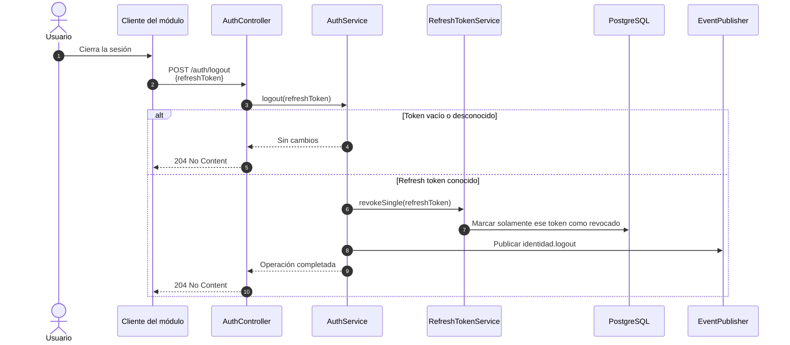

# Secuencia — Cierre de sesión

**Fecha de revisión:** 24 de septiembre de 2026
**Endpoint:** `POST /auth/logout`

El cierre de sesión recibe el refresh token en el cuerpo, no requiere un access token y es idempotente.

## Alcance de la revocación

- El endpoint revoca únicamente el refresh token presentado y no toda la cadena.
- Repetir la solicitud o enviar un token desconocido mantiene la respuesta `204 No Content`.
- El access token existente permanece válido hasta expirar; los servicios consumidores deben respetar su vida máxima de quince minutos.
- La revocación masiva de sesiones pertenece a otros casos: deshabilitación de una persona, cambio de contraseña o restablecimiento de contraseña.
