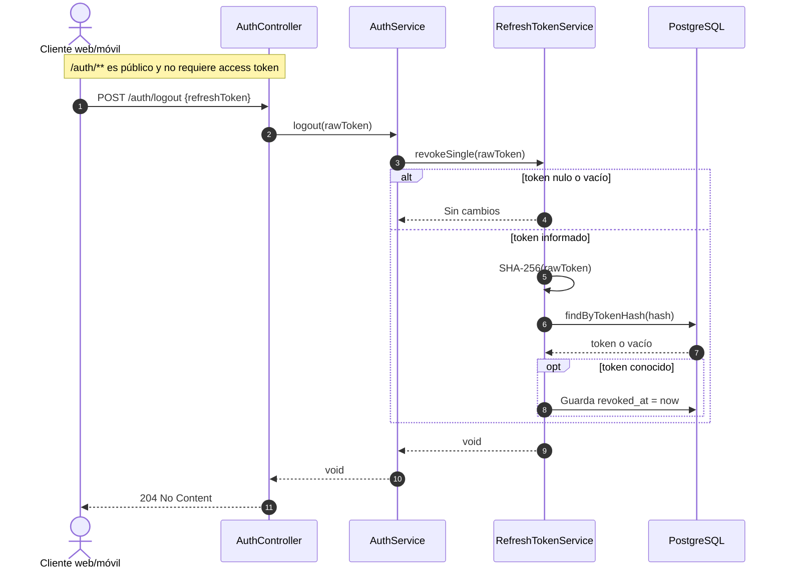

# Secuencia — Logout por refresh token

**Estado representado:** AS-IS del endpoint `POST /auth/logout`.

## Semántica de seguridad

1. El logout recibe el refresh token en el body; no identifica al usuario desde un JWT.
2. Solo revoca el refresh token presentado. Otros refresh tokens de la misma persona permanecen activos.
3. Un token desconocido devuelve también 204 para no revelar su existencia.
4. Los access tokens ya emitidos siguen válidos hasta su expiración máxima de 15 minutos.
5. La revocación masiva por `sub` es otra operación y se usa al deshabilitar una persona desde el panel.
