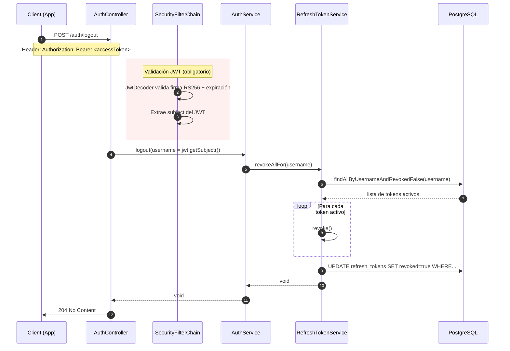

# Sequence Diagram — Flujo de Logout

## Resumen

1. **JWT obligatorio**: El endpoint `/auth/logout` NO es público — requiere un access token válido
2. **Identificación**: El `sub` del JWT identifica al usuario (no se recibe por body)
3. **Revocación masiva**: Se revocan TODOS los refresh tokens activos del usuario
4. **Access token**: Sigue válido hasta su expiración (15 min) — no hay blacklist
