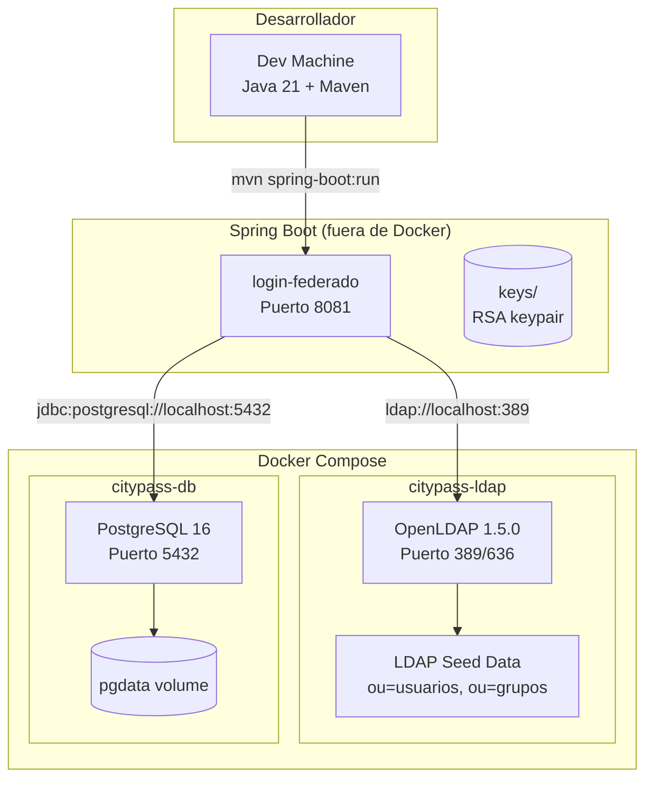
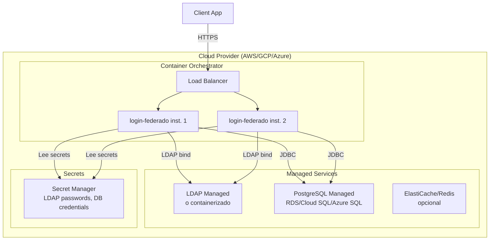

# Deployment Diagram — Login Federado

## Desarrollo (Docker Compose local)

## Producción (Cloud)

## Endpoints expuestos

| Endpoint | Método | Auth | Descripción |
|----------|--------|------|-------------|
| `/auth/login` | POST | Público | Login contra LDAP |
| `/auth/refresh` | POST | Público | Rotación de refresh token |
| `/auth/logout` | POST | JWT | Revoca todas las sesiones |
| `/.well-known/jwks.json` | GET | Público | Clave pública JWKS |
| `/docs` | GET | Público | Swagger UI |
| `/actuator/health` | GET | Público | Health check |
