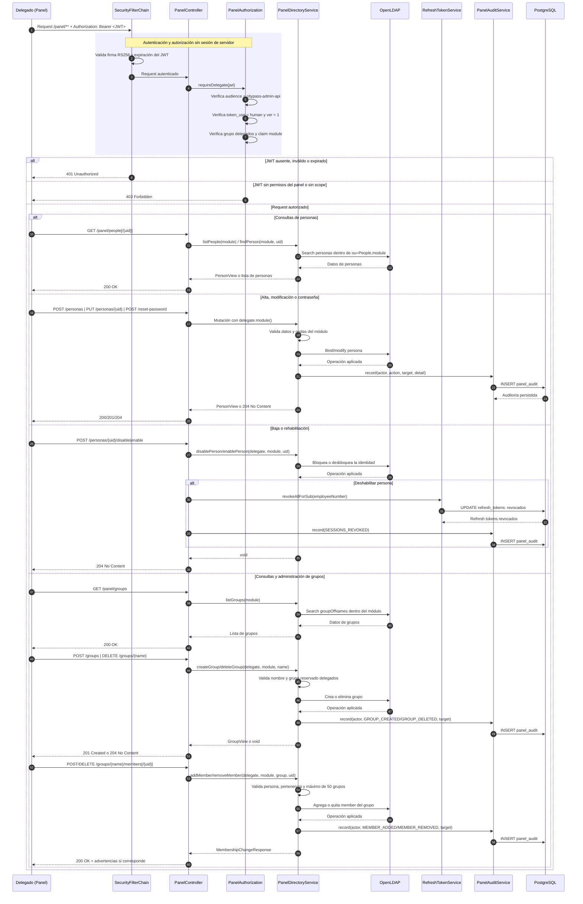

# Sequence Diagram — Administración del Panel

## Reglas representadas

1. **JWT obligatorio**: todos los endpoints `/panel/**` requieren un access token válido; el Panel no utiliza sesiones de servidor ni cookies.
2. **Delegado y scope**: el token debe tener `aud = citypass-admin-api`, `token_use = human`, `ver = 1`, el grupo `delegados` y un claim `module`. El módulo nunca se recibe por parámetro: se toma del token.
3. **Personas**: permite listar, consultar, crear, modificar, deshabilitar, rehabilitar y resetear contraseñas dentro del módulo del delegado.
4. **Deshabilitación**: no elimina la identidad; la bloquea en LDAP y revoca de inmediato todos sus refresh tokens.
5. **Grupos**: permite listar, crear, eliminar y administrar miembros. El grupo reservado `delegados` no se puede eliminar y solo admite personas, no grupos.
6. **Reglas de seguridad**: usernames y mails son únicos globalmente; los nombres de grupos usan minúsculas, números y guiones; cada persona puede pertenecer a un máximo de 50 grupos, con aviso desde 30.
7. **Auditoría**: las mutaciones del Panel se registran en `panel_audit` con el delegado, módulo, acción, objetivo y detalle.

## Endpoints incluidos

| Área | Operaciones |
|------|-------------|
| Personas | `GET /panel/people`, `GET /panel/people/{uid}`, `POST /panel/people`, `PUT /panel/people/{uid}` |
| Estado y credenciales | `POST /panel/people/{uid}/disable`, `POST /panel/people/{uid}/enable`, `POST /panel/people/{uid}/reset-password` |
| Grupos | `GET /panel/groups`, `POST /panel/groups`, `DELETE /panel/groups/{name}` |
| Membresías | `POST /panel/groups/{name}/members`, `DELETE /panel/groups/{name}/members/{uid}` |
``