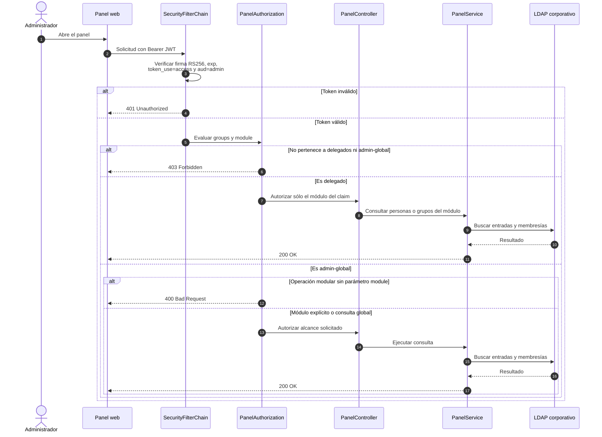
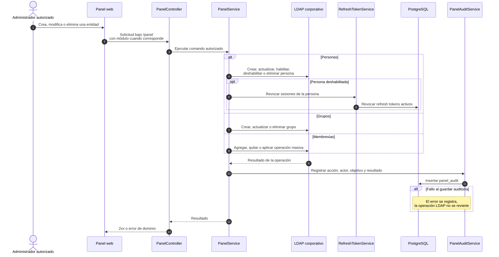

# Secuencias — Panel de administración

**Fecha de revisión:** 24 de septiembre de 2026
**Base de rutas:** `/panel`

El panel exige un JWT humano emitido para la audiencia `admin`. La autorización diferencia a los delegados de módulo de los administradores globales.

## Autorización y consultas

## Operaciones de escritura y auditoría

## Reglas vigentes

- Un delegado sólo opera sobre el módulo consignado en su token.
- `admin-global` puede operar transversalmente; las operaciones modulares requieren `?module=` y existen rutas de consulta global.
- Los módulos reconocidos son `movilidad`, `residuos`, `reclamos`, `emergencias`, `espacios`, `analitica` y `eda`.
- La implementación contempla excepciones administrativas para que `admin-global` pueda vaciar o eliminar el grupo `delegados`; por lo tanto, no debe documentarse como un invariante universal.
- La auditoría es de mejor esfuerzo y no conforma una transacción distribuida con LDAP.
