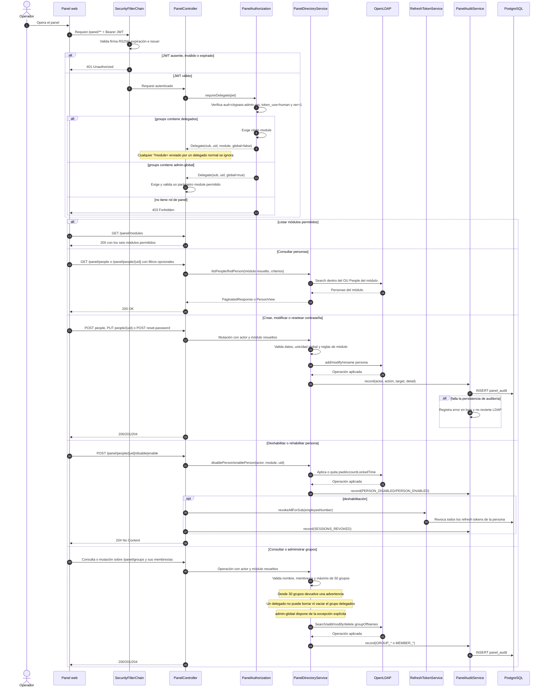

# Secuencia — Administración del directorio desde el panel

**Estado representado:** AS-IS de `/panel/**` para delegados de módulo y administradores globales.

## Reglas representadas

1. Todos los endpoints `/panel/**` requieren un access token válido; no se usan sesiones de servidor ni cookies.
2. Todo operador necesita `aud=citypass-admin-api`, `token_use=human` y `ver=1`.
3. Un delegado normal requiere el grupo `delegados` y opera únicamente el `module` de su token.
4. Un administrador global requiere `admin-global` y debe indicar un `?module=` válido en cada operación, salvo `GET /panel/modules`.
5. Deshabilitar una identidad bloquea LDAP y revoca todos sus refresh tokens; los access tokens sobreviven hasta expirar.
6. Personas y grupos se consultan con paginación y filtros dentro del módulo resuelto.
7. Las mutaciones intentan persistir auditoría en `panel_audit`; actualmente una falla de auditoría se registra en logs pero no revierte la modificación LDAP.

## Endpoints incluidos

| Área | Operaciones |
|---|---|
| Módulos | `GET /panel/modules` |
| Personas | `GET /panel/people`, `GET /panel/people/{uid}`, `POST /panel/people`, `PUT /panel/people/{uid}` |
| Estado y credenciales | `POST /panel/people/{uid}/disable`, `POST /panel/people/{uid}/enable`, `POST /panel/people/{uid}/reset-password` |
| Grupos | `GET /panel/groups`, `POST /panel/groups`, `DELETE /panel/groups/{name}` |
| Membresías | `POST /panel/groups/{name}/members`, `DELETE /panel/groups/{name}/members/{uid}` |

Los endpoints operables por un administrador global aceptan `?module=<módulo>`; para delegados normales ese parámetro no altera el módulo del JWT.
