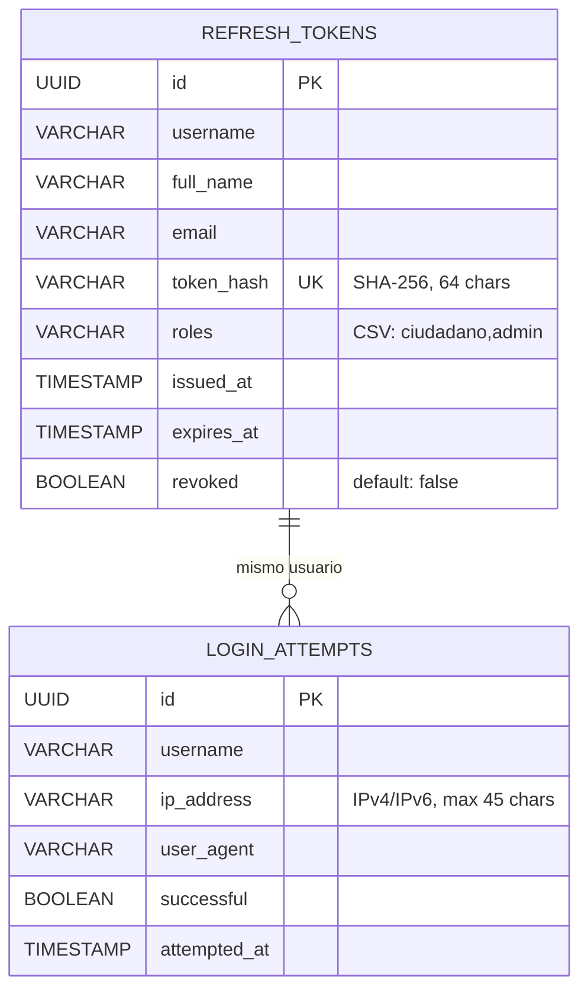

# Entity-Relationship Diagram — Base de Datos

## Índices

| Tabla | Índice | Campo(s) | Propósito |
|-------|--------|----------|-----------|
| `refresh_tokens` | `idx_refresh_tokens_username` | `username` | Buscar tokens por usuario (logout, rotación) |
| `login_attempts` | `idx_login_attempts_username` | `username` | Contar intentos fallidos por usuario |
| `login_attempts` | `idx_login_attempts_attempted_at` | `attempted_at` | Ventana deslizante de lockout |

## Política de retención

- **refresh_tokens**: Los tokens revocados/expirados se pueden limpiar periódicamente (cleanup job)
- **login_attempts**: Los registros viejos se "auto-limpian" de la ventana deslizante (15 min). Se pueden purgar registros con `attempted_at` > 24h para mantener la tabla liviana
