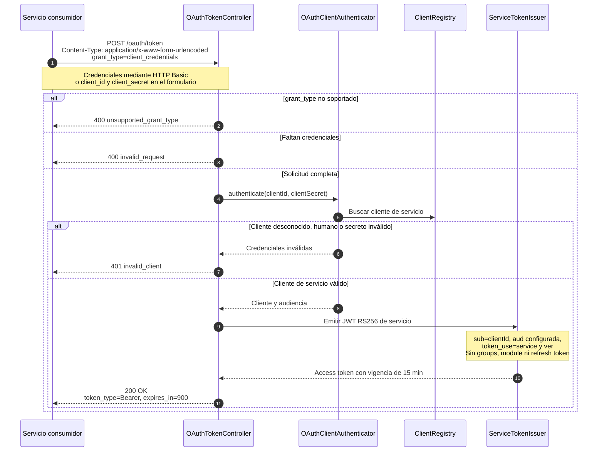

# Secuencia — OAuth 2.0 Client Credentials

**Fecha de revisión:** 24 de septiembre de 2026
**Endpoint:** `POST /oauth/token`

El flujo está destinado exclusivamente a integraciones máquina a máquina registradas como clientes de servicio.

Los clientes de servicio configurados actualmente son `group1`, `group5` y `grupo2`. La respuesta de error sigue el formato OAuth y no el contrato de autenticación humana.
