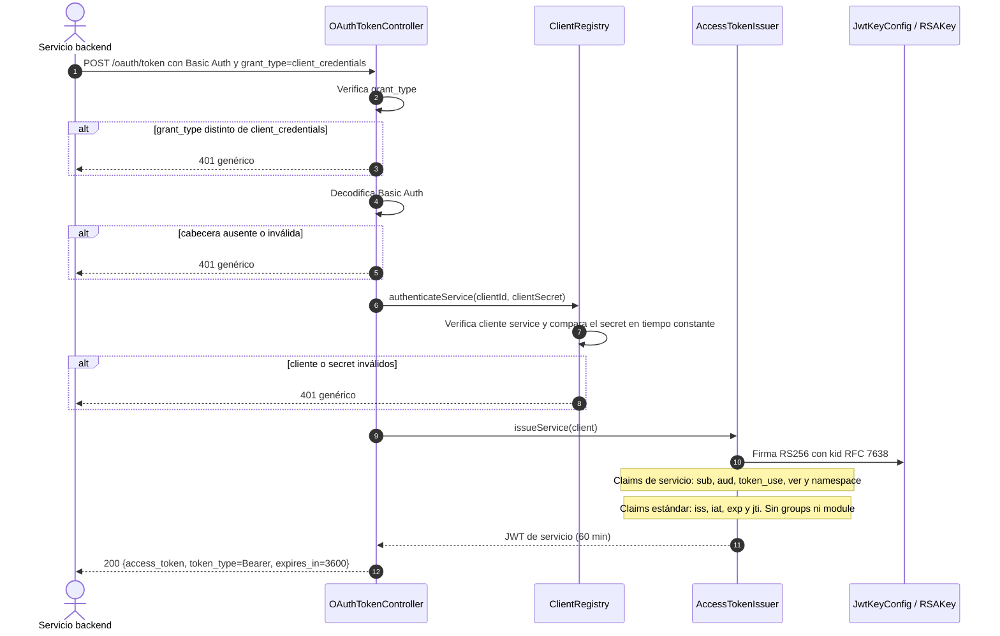

# Secuencia — Token de servicio con client_credentials

**Estado representado:** AS-IS del endpoint `POST /oauth/token`.

## Reglas reflejadas

1. El endpoint es público porque es el emisor del token; la autenticación se realiza mediante Basic Auth.
2. Solo admite clientes registrados con `type=service` y `grant_type=client_credentials`.
3. El token de servicio no representa a una persona y no contiene `groups` ni `module`.
4. No se emite refresh token para servicios.
