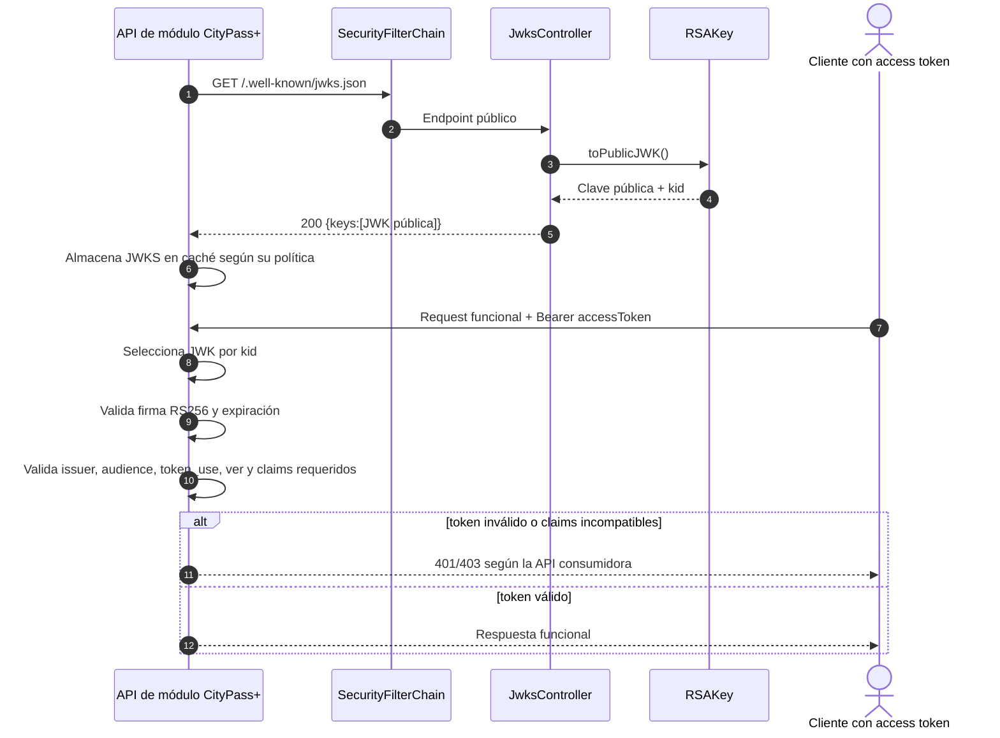

# Secuencia — Publicación y consumo de JWKS

**Estado representado:** publicación AS-IS en Login Federado y contrato esperado para las APIs consumidoras.

## Límites de responsabilidad

- Login Federado publica únicamente material público; la clave privada no sale del contenedor.
- La validación de cada request ocurre localmente en la API consumidora: no existe una llamada de introspección a Login Federado.
- Este repositorio implementa el endpoint JWKS. La política exacta de caché y validación de cada API debe verificarse en el repositorio de ese módulo.
- El `kid` se deriva de la huella RFC 7638 de la clave pública.
