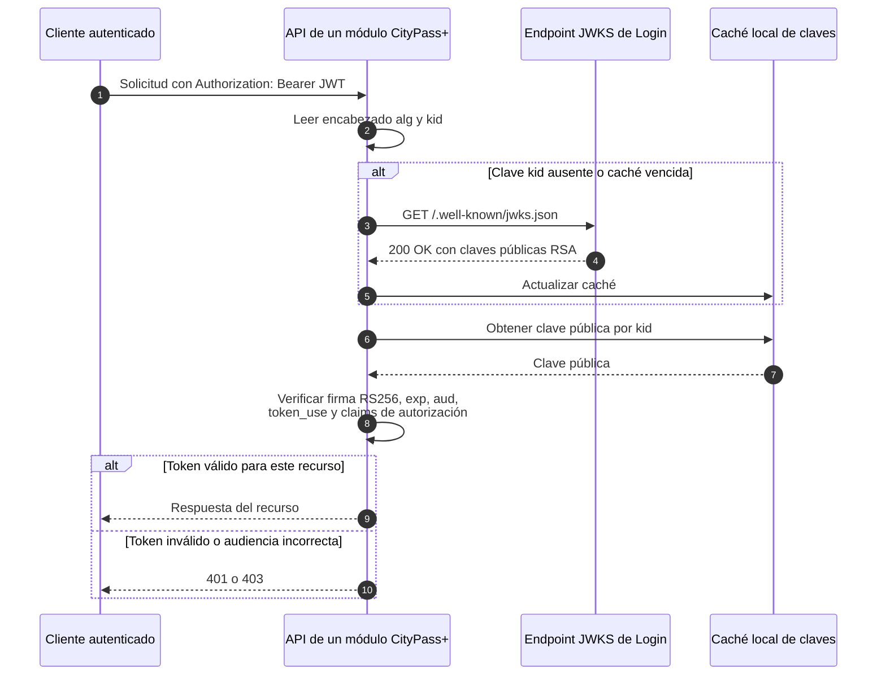

# Secuencia — Validación de JWT mediante JWKS

**Fecha de revisión:** 24 de septiembre de 2026
**Endpoint público:** `GET /.well-known/jwks.json`

Los módulos consumidores pueden validar localmente los access tokens sin consultar al módulo de Login en cada solicitud.

## Responsabilidades del consumidor

- Aceptar únicamente algoritmos y claves esperados; no confiar en el algoritmo declarado sin una política local.
- Validar expiración, audiencia y `token_use`, además de los claims funcionales necesarios.
- Renovar la caché cuando aparece un `kid` desconocido para admitir rotación de claves.
- Aplicar autorización propia: publicar JWKS resuelve la verificación criptográfica, no las reglas de negocio del módulo consumidor.
