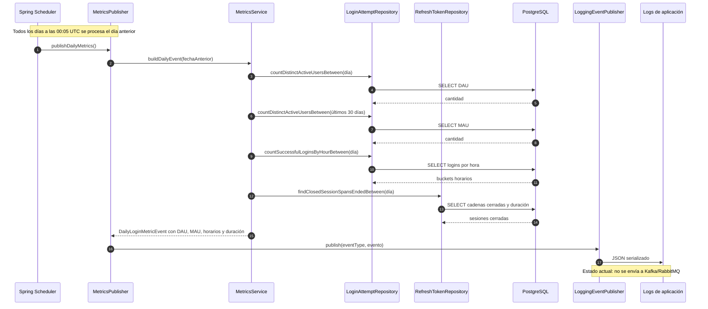

# Secuencia — Cálculo y publicación de métricas diarias

**Estado representado:** AS-IS del job programado de métricas.

## Evolución prevista

Cuando exista el contrato EDA definitivo, `LoggingEventPublisher` podrá reemplazarse por un adaptador de broker sin modificar `MetricsPublisher` ni `MetricsService`. Hasta entonces, cualquier diagrama TO-BE debe diferenciar claramente el broker planificado del logging actual.
