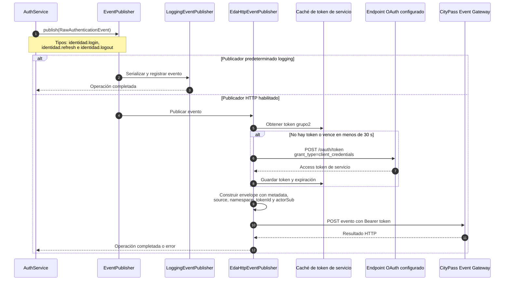

# Secuencia — Publicación de eventos de identidad para EDA y métricas

**Fecha de revisión:** 24 de septiembre de 2026

El backend produce eventos crudos de autenticación. No calcula actualmente DAU, MAU ni agregados diarios; esas métricas corresponden a consumidores posteriores del flujo EDA.

## Estado actual

- `LoggingEventPublisher` es el modo predeterminado y deja evidencia local del evento.
- `EdaHttpEventPublisher` es opcional y requiere configuración explícita del gateway y del endpoint OAuth.
- La entrega HTTP es sincrónica y no existe una bandeja transaccional (*outbox*); un fallo puede propagarse después de que la autenticación haya modificado estado.
- El contrato incluye datos de identidad mínimos para que otro módulo realice métricas, auditoría o detección de patrones, sin incorporar un planificador diario en este backend.

