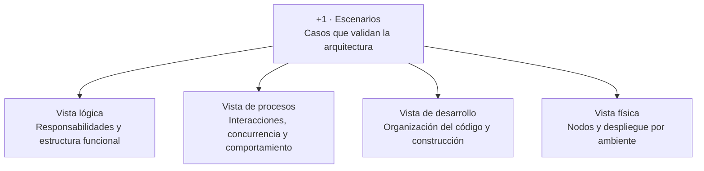
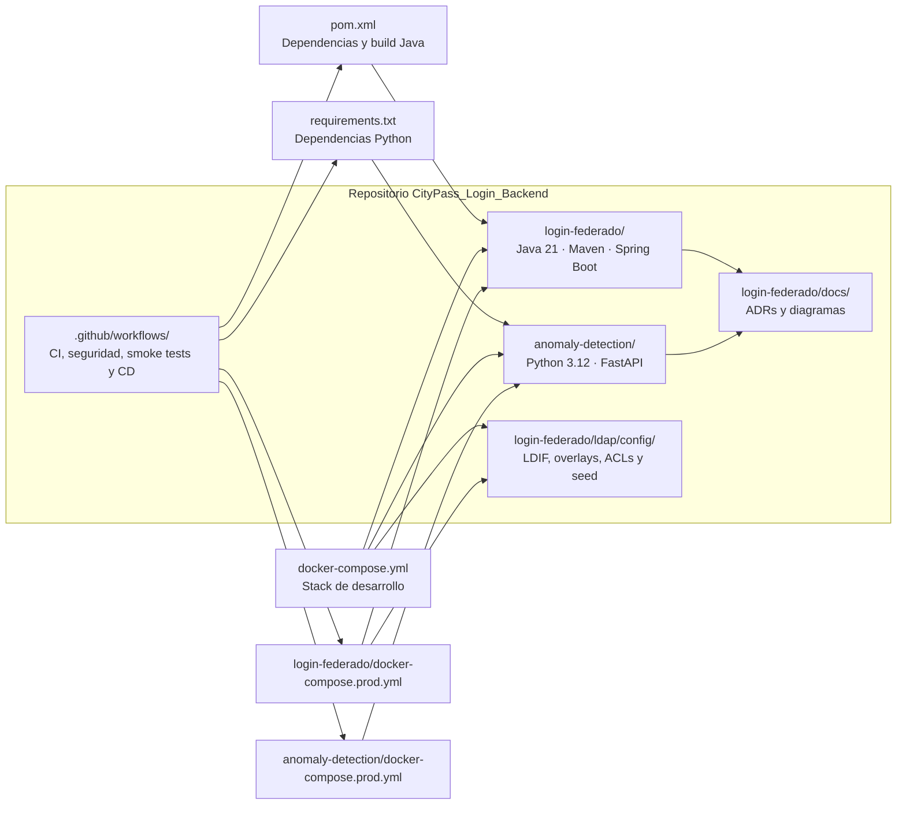

# Modelo arquitectónico 4+1 — Identidad y Acceso CityPass+

**Estado:** índice AS-IS y trazabilidad de las cinco vistas.

**Última actualización:** 2026-09-19.

## Trazabilidad de vistas

| Vista 4+1 | Pregunta que responde | Artefactos |
|---|---|---|
| Lógica | ¿Qué responsabilidades existen y cómo dependen entre sí? | [Contexto C4](01-c4-contexto.md), [contenedores C4](02-c4-contenedores.md), [componentes C4](03-c4-componentes.md) |
| Procesos | ¿Cómo colaboran los procesos y componentes en runtime? | [Login](04-sequence-login.md), [refresh](05-sequence-refresh.md), [logout](06-sequence-logout.md), [panel](07-panel-administracion.md), [client_credentials](08-sequence-oauth-service-token.md), [JWKS](09-sequence-jwks.md), [métricas](10-sequence-metricas.md) |
| Desarrollo | ¿Cómo está organizado, construido y versionado el software? | Diagrama de desarrollo incluido debajo |
| Física | ¿Dónde se ejecutan las instancias y cómo se conectan? | [Desarrollo local](12-cloud-development.md), [producción Cloud](13-cloud-production.md) |
| +1 Escenarios | ¿Qué casos concretos validan las cuatro vistas? | Matriz de escenarios incluida debajo y diagramas de secuencia |

## Vista de desarrollo

### Responsabilidad por módulo

- `login-federado`: API HTTP, seguridad, LDAP, JWT, refresh tokens, panel, auditoría y métricas.
- `anomaly-detection`: features, reglas/modelo de riesgo y endpoints `/score` y `/health`.
- `ldap/config`: configuración reproducible del directorio y datos iniciales.
- `.github/workflows`: construcción, análisis, publicación de imágenes y despliegue remoto.
- `docs`: decisiones arquitectónicas y vistas sincronizadas con el código.

## +1 — Escenarios arquitectónicos

| ID | Escenario | Actores/sistemas | Resultado esperado | Diagrama |
|---|---|---|---|---|
| S1 | Login humano permitido | App, Login, LDAP, anomalías, PostgreSQL | Access + refresh token | [04](04-sequence-login.md) |
| S2 | Login bloqueado por umbral, riesgo o dependencia caída | App, Login, LDAP, anomalías | 401 genérico sin emitir tokens | [04](04-sequence-login.md) |
| S3 | Refresh válido con permisos actualizados | App, Login, LDAP, PostgreSQL | Nuevo par; token anterior revocado | [05](05-sequence-refresh.md) |
| S4 | Reuso de refresh token | App, Login, PostgreSQL | Cadena completa revocada | [05](05-sequence-refresh.md) |
| S5 | Logout de una sesión | App, Login, PostgreSQL | Refresh presentado revocado; 204 | [06](06-sequence-logout.md) |
| S6 | Administración delegada | Panel, delegado, Login, LDAP | Operación limitada al módulo del JWT | [07](07-panel-administracion.md) |
| S7 | Administración global | Panel, admin global, Login, LDAP | Operación sobre `?module=` validado | [07](07-panel-administracion.md) |
| S8 | Token backend-a-backend | Servicio, Login | JWT de servicio sin refresh | [08](08-sequence-oauth-service-token.md) |
| S9 | Validación offline de JWT | API de módulo, Login/JWKS | Request validado sin introspección | [09](09-sequence-jwks.md) |
| S10 | Métricas diarias | Scheduler, PostgreSQL, logs | Evento diario serializado | [10](10-sequence-metricas.md) |

## Criterio de mantenimiento

Todo cambio en endpoints, claims, tiempos de expiración, topología, almacenamiento, roles del panel o publicación de eventos debe actualizar en el mismo cambio los diagramas afectados y esta matriz de trazabilidad.
