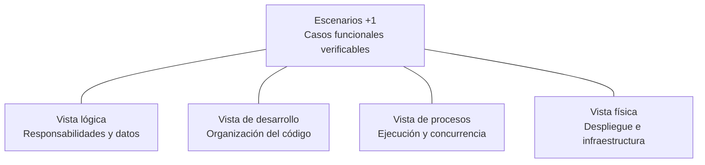
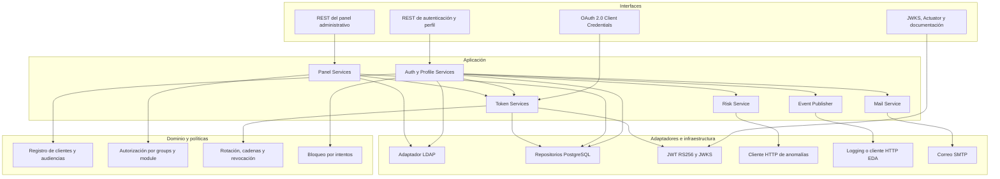
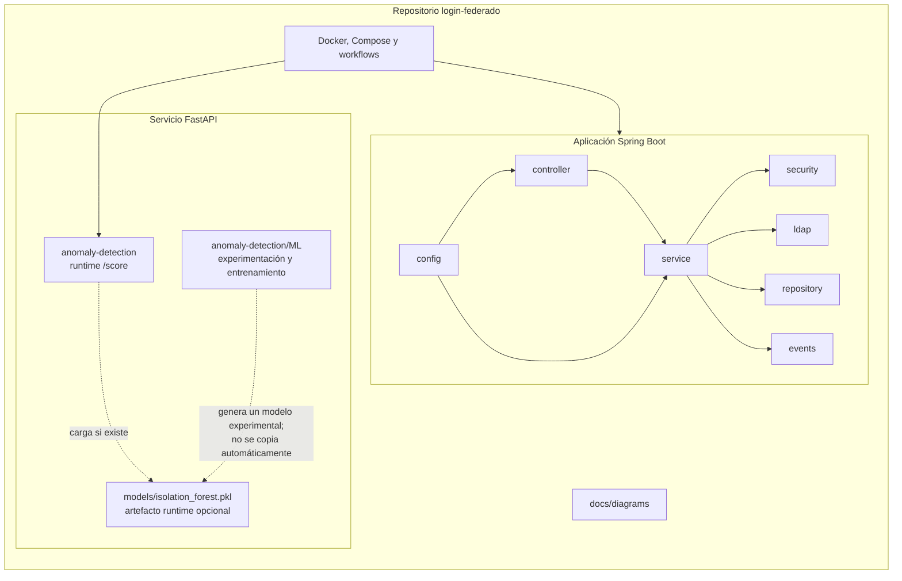
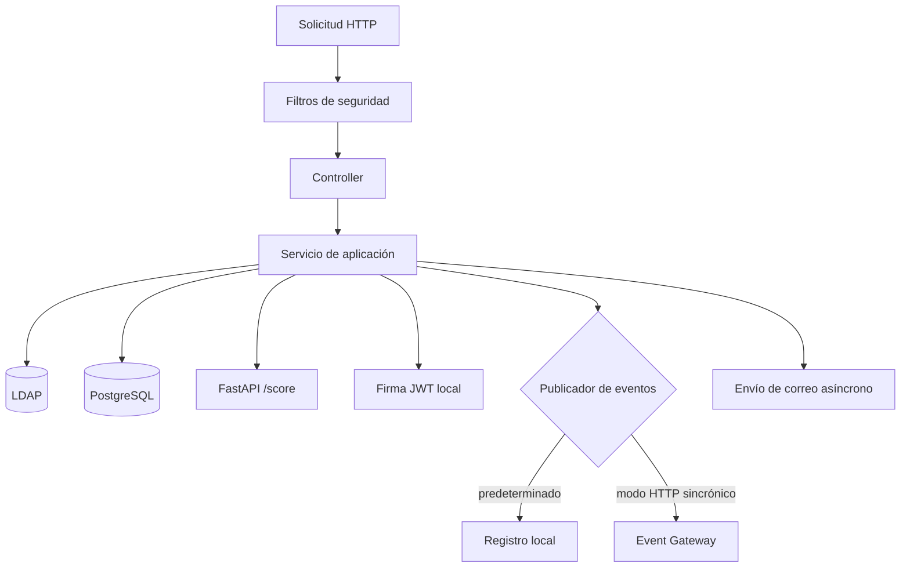

# Arquitectura 4+1 — Módulo de Login Federado

**Estado documentado:** implementación actual (*as-is*)
**Fecha de revisión:** 24 de septiembre de 2026

El modelo 4+1 organiza la arquitectura desde cinco perspectivas complementarias. El sistema de interés es exclusivamente el Módulo de Login Federado e Identidad; los demás módulos CityPass+ se consideran consumidores externos durante la etapa de desarrollo aislado.

## 1. Vista lógica

La identidad y los grupos viven en LDAP. PostgreSQL conserva tokens de renovación, intentos de acceso, solicitudes y tokens de restablecimiento, y auditoría del panel. La clave privada RSA queda restringida al emisor; la pública se expone mediante JWKS.

## 2. Vista de desarrollo

La aplicación Java concentra el contrato de identidad. FastAPI es un proceso separado y su modelo de aislamiento es opcional: si el archivo no está en la ruta runtime, aplica reglas determinísticas. El artefacto entrenado bajo `ML/models` no se empaqueta automáticamente como `models/isolation_forest.pkl`.

## 3. Vista de procesos

- La API es esencialmente sin estado para access tokens; el estado de sesión renovable reside en PostgreSQL.
- LDAP, PostgreSQL y la evaluación de riesgo forman parte sincrónica de los flujos de autenticación.
- La rotación usa una actualización condicional para resolver concurrencia; el perdedor provoca la revocación de la cadena.
- El correo de recuperación se delega a un ejecutor asíncrono. La publicación EDA por HTTP, cuando se habilita, permanece sincrónica.
- No hay transacción distribuida entre LDAP, PostgreSQL, SMTP y el gateway; se documentan explícitamente los puntos de consistencia eventual o mejor esfuerzo.

## 4. Vista física

La topología local se detalla en [12-cloud-deployment-dev.md](12-cloud-deployment-dev.md) y la topología de producción en [13-cloud-deployment-prod.md](13-cloud-deployment-prod.md). En resumen, desarrollo ejecuta los componentes mediante Docker Compose; producción separa el backend y LDAP del servicio de anomalías, y utiliza PostgreSQL administrado.

## +1. Escenarios representativos

| Escenario | Recorrido arquitectónico | Resultado esperado |
| --- | --- | --- |
| Login humano | REST → registro de clientes → bloqueo → LDAP → riesgo → JWT/refresh → evento | Access token de 15 min y refresh token de 8 h |
| Renovación | REST → hash en PostgreSQL → rotación atómica → LDAP → JWT → evento | Nuevos tokens; la reutilización revoca la cadena |
| Logout | REST público → revocación de un refresh token → evento | `204` idempotente; el access token expira naturalmente |
| Recuperación de contraseña | REST → límites en PostgreSQL → correo → cambio en LDAP → revocación masiva | Respuesta no enumerativa y cierre de sesiones renovables |
| Administración delegada | JWT `aud=admin` → política groups/module → LDAP → auditoría | Operación limitada al módulo del delegado |
| Administración global | JWT `aud=admin` → política admin-global → módulo explícito o ruta global | Operación transversal controlada |
| Integración M2M | Formulario OAuth → registro de clientes → JWT de servicio → JWKS | Token sin groups/module/refresh, válido por 15 min |
| Publicación EDA | Evento crudo → logging o gateway HTTP autenticado | Evento disponible para consumidores; sin agregación local |

## Trazabilidad

- Contexto C4: `01-c4-contexto.md`.
- Contenedores C4: `02-c4-contenedores.md`.
- Componentes C4: `03-c4-componentes.md`.
- Secuencias: `04` a `10`.
- Despliegues: `12` y `13`.
