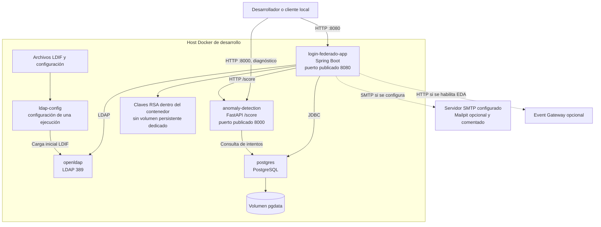

# Cloud / Deployment — Entorno de desarrollo

**Fecha de revisión:** 24 de septiembre de 2026
**Artefacto fuente:** Docker Compose de desarrollo

## Inventario

| Unidad | Responsabilidad | Persistencia / estado |
| --- | --- | --- |
| Aplicación Spring Boot | REST, OAuth, panel, JWT, LDAP, eventos y correo | Estado durable en LDAP/PostgreSQL; claves locales al contenedor |
| OpenLDAP | Identidades, atributos, grupos y membresías | Datos del contenedor; inicialización por `ldap-config` |
| `ldap-config` | Aplica configuración y datos LDIF | Proceso de una sola ejecución |
| PostgreSQL | Refresh tokens, intentos, auditoría y recuperación | Volumen Docker `pgdata` |
| FastAPI | Puntaje de anomalía | Consulta PostgreSQL; usa modelo sólo si existe en la ruta runtime |

## Observaciones

- El esquema SQL usa creación idempotente de tablas y no recrea destructivamente la base en cada inicio.
- El runtime de anomalías puede operar con reglas determinísticas. El repositorio no contiene actualmente `anomaly-detection/models/isolation_forest.pkl` como artefacto desplegable.
- El publicador predeterminado es local por logging; el gateway EDA no es necesario para levantar el módulo aislado.
- El correo requiere SMTP. Mailpit aparece como alternativa local opcional, no como dependencia activa del Compose.
- La falta de un volumen dedicado para claves en desarrollo implica que una recreación puede cambiar el material criptográfico según la configuración utilizada.
