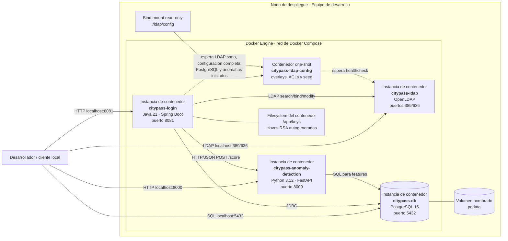

# Despliegue — Desarrollo local con Docker Compose

**Ambiente:** desarrollo.

**Fuente de verdad:** `docker-compose.yml`, `Dockerfile` y `application.yml`.

## Inventario y puertos

| Instancia | Imagen/build | Puerto publicado | Persistencia/configuración |
|---|---|---|---|
| `citypass-login` | Build local de `login-federado/Dockerfile` | `8081:8081` | Claves RSA en `/app/keys` dentro del contenedor |
| `citypass-ldap` | `osixia/openldap:1.5.0` | `389:389`, `636:636` | Configurado por el job `ldap-config` |
| `citypass-ldap-config` | `osixia/openldap:1.5.0` | No aplica | `./ldap/config:/config:ro`; termina al aplicar configuración y seed |
| `citypass-db` | `postgres:16-alpine` | `5432:5432` | Volumen nombrado `pgdata` |
| `citypass-anomaly-detection` | Build local de `anomaly-detection/Dockerfile` | `8000:8000` | Consulta la misma PostgreSQL de desarrollo |

## Consideraciones

- Este ambiente está pensado para desarrollo y pruebas; los secretos incluidos en Compose son valores locales.
- `schema.sql` se ejecuta en cada arranque y recrea las tablas de autenticación, por lo que los refresh tokens dejan de ser válidos.
- El Event Bus no forma parte de este despliegue: los eventos se escriben en logs.
