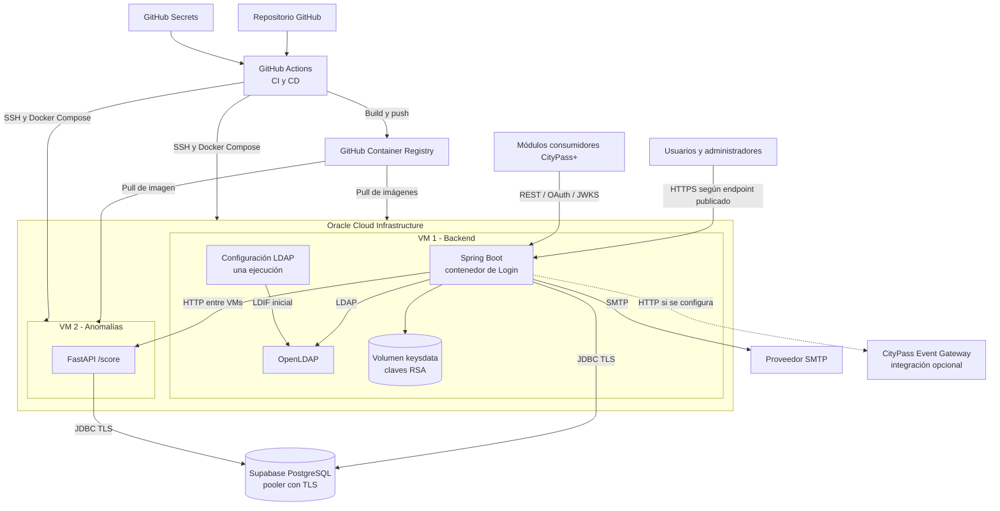

# Cloud / Deployment — Entorno de producción

**Fecha de revisión:** 24 de septiembre de 2026
**Artefactos fuente:** Docker Compose de producción y workflows CI/CD

## Flujo CI/CD vigente

1. La integración continua ejecuta compilación, lint, pruebas y análisis Sonar, además de Gitleaks y análisis Trivy de configuración e imágenes.
2. La entrega continua construye y publica imágenes en GHCR.
3. El despliegue conecta por SSH a las dos VMs y actualiza los servicios con sus Compose correspondientes.
4. El backend verifica salud mediante Actuator. El endpoint operativo público documentado para contenedores es `/actuator/health`; el endpoint personalizado `/health` no está expresamente abierto por la configuración de seguridad.

## Persistencia y secretos

| Recurso | Tratamiento actual |
| --- | --- |
| PostgreSQL | Servicio administrado Supabase mediante pooler y TLS |
| Claves RSA | Volumen `keysdata` montado en `/app/keys` en VM 1 |
| Credenciales y hosts | Inyectados desde secretos/variables de despliegue |
| LDAP | Ejecutado en VM 1; el Compose productivo no declara volumen de datos LDAP |
| Modelo de anomalía | Incluido sólo si el artefacto runtime se incorpora a la imagen de FastAPI |

## Riesgos y acciones pendientes de infraestructura

- **Durabilidad LDAP:** declarar y respaldar un volumen de datos para evitar pérdida de identidades al recrear el contenedor.
- **Perímetro y TLS:** documentar reverse proxy, certificados, DNS, puertos publicados y reglas de red; no están definidos por los Compose revisados.
- **Comunicación entre VMs:** restringir el acceso a FastAPI y cifrar o aislar el tráfico según la red disponible.
- **Claves de firma:** definir respaldo, rotación y conservación del volumen `keysdata`, manteniendo la clave privada fuera de imágenes y repositorio.
- **EDA:** las variables del publicador HTTP no están declaradas en el Compose/CD productivo revisado; sin configuración adicional se conserva el modo logging.
- **Infraestructura como código:** el repositorio automatiza aplicaciones y contenedores, pero no aprovisiona VMs, red, DNS, certificados ni Supabase. Ese alcance debe documentarse o incorporarse antes de afirmar IaC completa.
- **Entrega confiable de eventos:** si EDA se vuelve obligatoria, agregar un patrón outbox o cola para desacoplar la autenticación del gateway y permitir reintentos.
