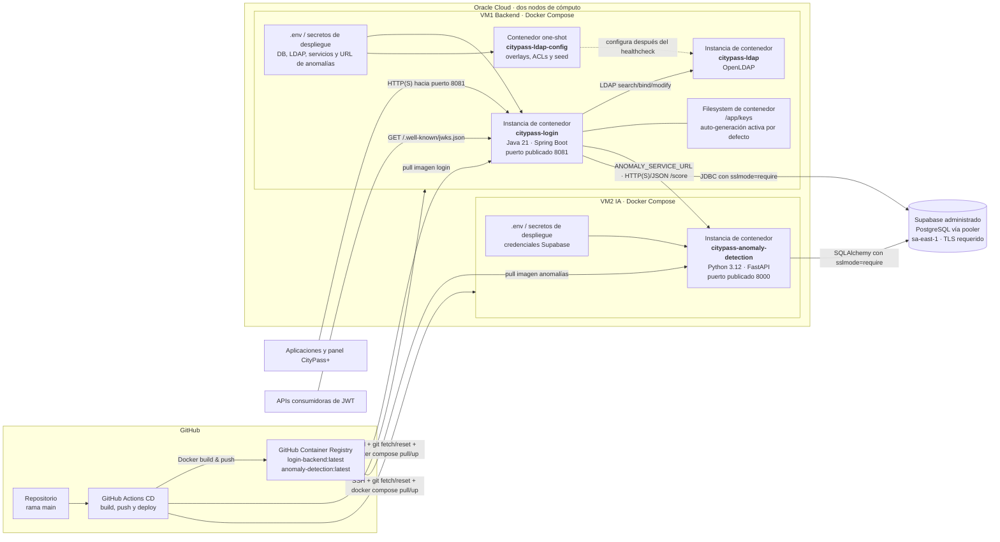

# Despliegue Cloud — Producción

**Ambiente:** producción AS-IS según los archivos versionados.

**Fuente de verdad:** GitHub Actions `CD.yml`, ambos `docker-compose.prod.yml` y la configuración Spring/FastAPI.

## Responsabilidades por nodo

| Nodo/servicio | Responsabilidad |
|---|---|
| GitHub Actions | Construye las dos imágenes, las publica en GHCR y ejecuta el redeploy remoto por SSH. |
| Oracle VM1 | Ejecuta Login Federado, OpenLDAP y el configurador one-shot del directorio. |
| Oracle VM2 | Ejecuta exclusivamente el servicio de detección de anomalías. |
| Supabase | Aloja PostgreSQL compartido por Login Federado y detección de anomalías. |
| GHCR | Distribuye las imágenes versionadas por rama, SHA y `latest`. |

## Fronteras y comunicaciones

- Las APIs consumidoras solo necesitan acceso al JWKS público y validan tokens localmente.
- Login Federado depende sincrónicamente de VM2 durante el login; si `/score` no responde dentro de los timeouts configurados, el login falla cerrado.
- OpenLDAP no se publica mediante `ports` en el Compose de producción y queda accesible para los contenedores de VM1.
- PostgreSQL exige TLS mediante `sslmode=require`.
- El repositorio no documenta una instancia de load balancer, reverse proxy, DNS, certificado TLS, reglas OCI ni VPN; si existen fuera del repositorio deben agregarse como nodos de infraestructura verificados.

## Riesgos y decisiones pendientes visibles en el AS-IS

1. **Claves RSA:** `docker-compose.prod.yml` no monta un volumen o secret para `/app/keys` ni desactiva `jwt.auto-generate-keys`. Una recreación del contenedor puede cambiar el par y el `kid`, invalidando access tokens todavía vigentes.
2. **Inicialización SQL:** `spring.sql.init.mode=always` sigue activo y `schema.sql` elimina y recrea `panel_audit`, `refresh_tokens` y `login_attempts` durante el arranque, incluso usando la conexión productiva de Supabase.
3. **Persistencia LDAP:** no hay volúmenes nombrados ni política de backup documentada en el Compose productivo; debe confirmarse y representarse la persistencia efectiva del directorio.
4. **Exposición de VM2:** Compose publica el puerto 8000. Debe verificarse en la infraestructura real que solo VM1 pueda acceder a `/score`, salvo que exista un motivo para exposición pública.
5. **Event Bus:** no se despliega Kafka/RabbitMQ; la publicación actual termina en logs. Un broker futuro debe incorporarse en una vista TO-BE, con autenticación, topics y política de entrega definidos.
