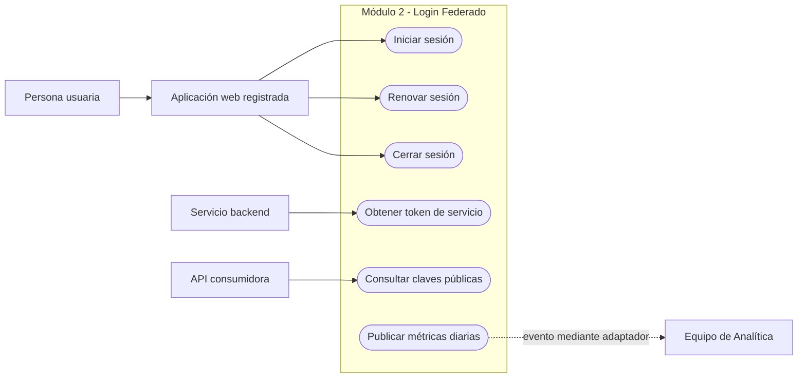
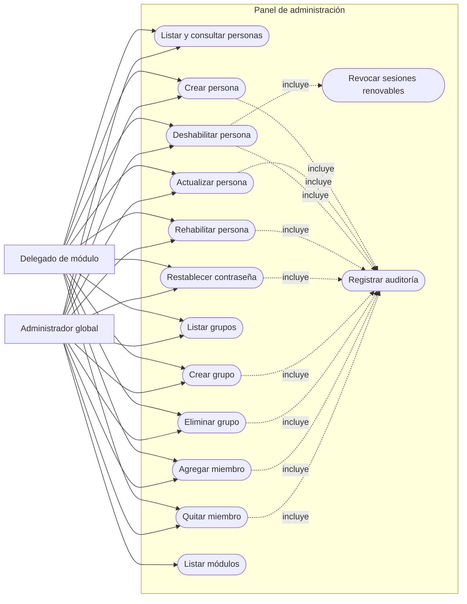

# UML - Casos de uso del módulo Login Federado

Versión corregida a partir del diagrama publicado en Notion y contrastada con los endpoints actuales. Mermaid no posee una notación UML de casos de uso estable en todos los renderizadores, por lo que se utiliza un `flowchart` con actores, límite de sistema y relaciones etiquetadas.

Fuente original: [Diagramas UML (CU, ER) - Módulo 2](https://app.notion.com/p/drff/Diagramas-UML-CU-ER-Modulo-2-3c977c7e30048071b13dd90ecd96a45b?source=copy_link)

## Autenticación e integración

Reglas relevantes:

- El login usa un cliente humano registrado y valida que su módulo acepte a la persona.
- Refresh rota el token, relee LDAP y revoca toda la cadena ante reúso.
- Logout revoca el refresh token presentado; el access token expira naturalmente.
- Client Credentials emite un token de servicio sin grupos, módulo ni refresh token.
- La publicación de eventos y métricas usa actualmente un adaptador de logging, no un broker real.

## Panel de administración

Reglas de autorización:

- Ambos actores necesitan un JWT humano con audiencia `citypass-admin-api` y versión de contrato `1`.
- El delegado opera exclusivamente el módulo de su claim `module`.
- El administrador global debe indicar un `?module=` válido en cada operación sobre personas o grupos.
- No existe el caso de uso "eliminar persona"; la baja se implementa mediante deshabilitación en LDAP.
- El grupo reservado `delegados` no se elimina y no puede quedar vacío.
