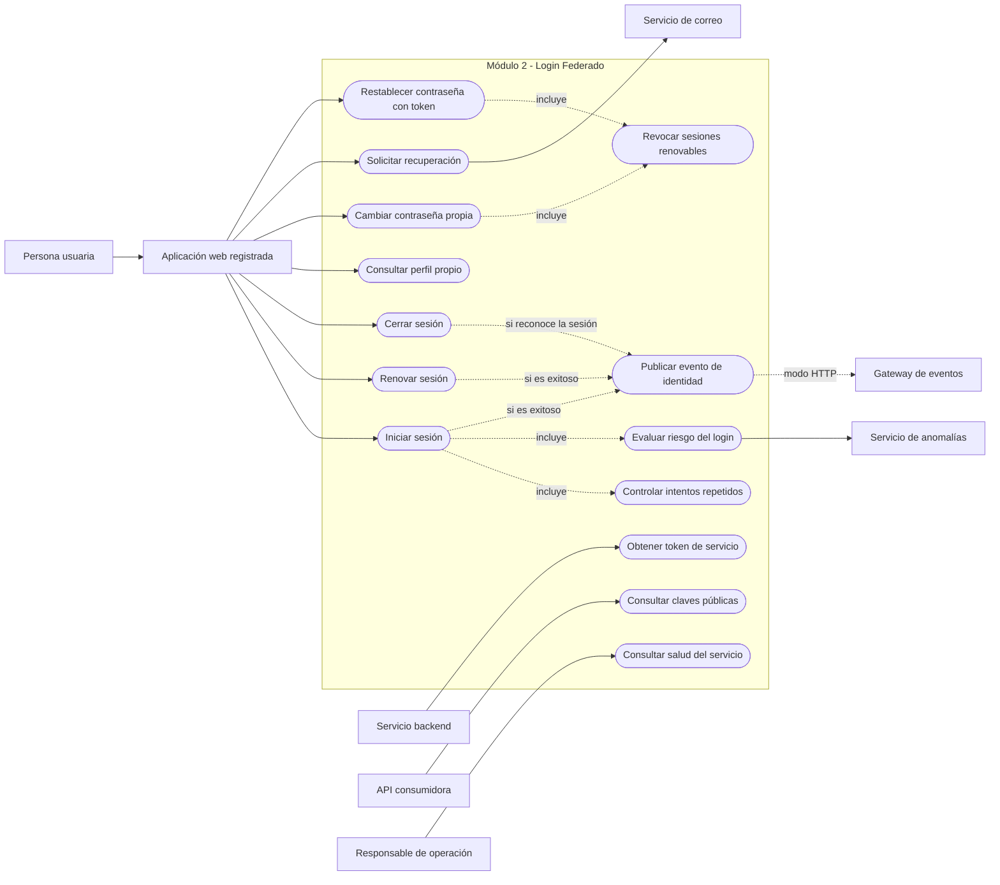
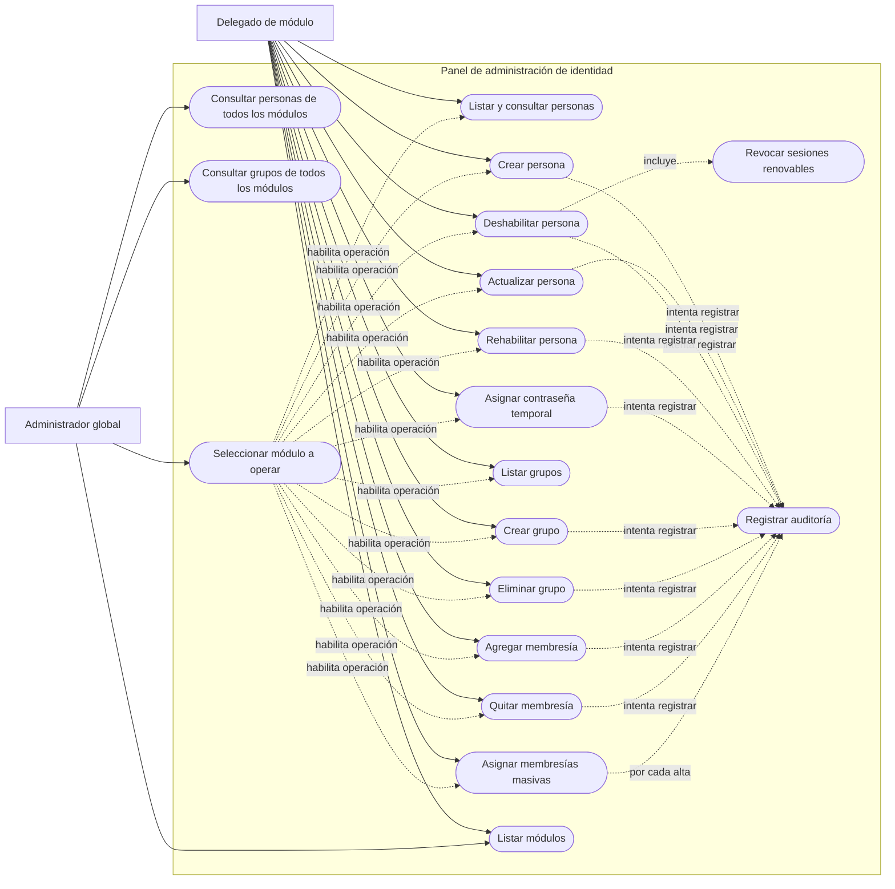

# UML — Casos de uso del módulo Login Federado

**Módulo:** Login Federado e Identidad — Grupo 2  
**Fecha de revisión:** 24 de septiembre de 2026  
**Estado:** actualizado contra el backend y las historias de usuario vigentes

Fuente original: [Diagramas UML (CU, ER) — Módulo 2](https://app.notion.com/p/drff/Diagramas-UML-CU-ER-Modulo-2-3c977c7e30048071b13dd90ecd96a45b?source=copy_link)

## 1. Convención utilizada

Mermaid no ofrece una sintaxis UML de casos de uso compatible con todos los renderizadores. Por ese motivo, los diagramas utilizan `flowchart`, actores externos, un límite explícito del sistema y nodos ovalados para los casos de uso.

- Las flechas continuas representan participación del actor.
- Las flechas discontinuas representan una relación incluida o una consecuencia interna.
- Los servicios externos quedan fuera del límite del módulo.
- Los casos de uso describen comportamiento comprobable; no representan clases ni componentes internos.

## 2. Autenticación, sesión e integración

### Trazabilidad funcional

| Caso de uso | Endpoint principal | Reglas relevantes |
| --- | --- | --- |
| Iniciar sesión | `POST /auth/login` | Exige `username`, `password` y `clientId`; autentica contra LDAP; valida cliente y módulo; emite JWT humano por 15 minutos y refresh token por 8 horas. |
| Controlar intentos repetidos | Incluido en login | Cinco fallos dentro de 15 minutos activan el bloqueo temporal; el error externo continúa siendo genérico. |
| Evaluar riesgo | `POST /score` del servicio externo | Se ejecuta después del bind LDAP; `BLOCK` rechaza y una falla del servicio aplica comportamiento cerrado. |
| Renovar sesión | `POST /auth/refresh` | Rota el refresh token, relee LDAP y revoca la cadena completa ante reúso o canje concurrente. |
| Cerrar sesión | `POST /auth/logout` | Revoca el refresh token presentado y responde `204` aunque sea desconocido; el access token expira naturalmente. |
| Consultar perfil | `GET /me` | Solo acepta token humano y relee la identidad desde LDAP. |
| Cambiar contraseña | `POST /me/change-password` | Verifica la contraseña actual y revoca todos los refresh tokens de la persona. |
| Solicitar recuperación | `POST /auth/forgot-password` | Responde siempre `204`, aplica límites antiabuso y envía un enlace de un solo uso de manera asíncrona. |
| Restablecer contraseña | `POST /auth/reset-password` | Consume atómicamente el token, cambia la contraseña y revoca las sesiones renovables. |
| Obtener token de servicio | `POST /oauth/token` | Usa Client Credentials; admite Basic Auth o formulario; emite un JWT de servicio por 15 minutos, sin grupos ni refresh token. |
| Consultar claves públicas | `GET /.well-known/jwks.json` | Publica la clave RSA y el `kid` necesarios para validar JWT RS256. |
| Consultar salud | `GET /health` o `/actuator/health` | Existe una diferencia pendiente entre la ruta declarada por EDA y la ruta pública configurada. |
| Publicar evento | Sin endpoint de usuario | Publica `identidad.login`, `identidad.refresh` o `identidad.logout`; el modo predeterminado escribe el envelope en logs. |

### Restricciones representadas

- Todos los errores de autenticación humana utilizan una respuesta `401` genérica para evitar enumeración de cuentas y reglas internas.
- El evaluador de anomalías es una dependencia sincrónica del login; no es un actor humano.
- El correo se utiliza únicamente para entregar el enlace de recuperación. La solicitud no cambia la contraseña en LDAP.
- El gateway de eventos es opcional en la ejecución aislada. La integración HTTP requiere configuración y disponibilidad externas.
- El JWT de servicio identifica al cliente por `sub` y `namespace`; nunca representa a una persona.

## 3. Panel de administración

### Trazabilidad funcional

| Caso de uso | Endpoint principal | Alcance y reglas |
| --- | --- | --- |
| Listar y consultar personas | `GET /panel/people`, `GET /panel/people/{uid}` | El delegado queda limitado al módulo del JWT; permite paginación y filtros. |
| Crear persona | `POST /panel/people` | Genera `employeeNumber` global, secuencial e inmutable; username y correo son únicos globalmente. |
| Actualizar persona | `PUT /panel/people/{uid}` | Puede renombrar el username y repara las referencias de membresía; no modifica `employeeNumber`. |
| Deshabilitar persona | `POST /panel/people/{uid}/disable` | Bloquea la cuenta sin eliminarla y revoca todos sus refresh tokens. |
| Rehabilitar persona | `POST /panel/people/{uid}/enable` | Elimina el bloqueo conservando identidad y membresías. |
| Asignar contraseña temporal | `POST /panel/people/{uid}/reset-password` | Cambia la contraseña en LDAP; todavía no revoca refresh tokens ni fuerza de forma verificable el cambio posterior. |
| Listar y crear grupos | `GET /panel/groups`, `POST /panel/groups` | Los grupos pertenecen a un módulo; nombre de hasta 64 caracteres en minúsculas, números y guiones. |
| Eliminar grupo | `DELETE /panel/groups/{name}` | El delegado no puede eliminar `delegados`; el código permite hacerlo a `admin-global`, decisión pendiente de validar. |
| Agregar o quitar membresía | Rutas `/panel/groups/{name}/members` | Solo personas del mismo módulo; advertencia desde 30 grupos y máximo de 50 por persona. |
| Asignar membresías masivas | `POST /panel/group-memberships/bulk` | Producto cartesiano deduplicado, hasta 1.000 relaciones; informa resultado total y por relación. |
| Listar módulos | `GET /panel/modules` | Devuelve los siete módulos habilitados actualmente. |
| Consultas globales | `GET /panel/admin/people`, `GET /panel/admin/groups` | Exclusivas de `admin-global`; agregan, filtran y paginan datos de todos los módulos. |

### Reglas de autorización y coherencia

- El panel requiere un JWT humano con audiencia `citypass-admin-api`, `ver=1` y grupo `delegados` o `admin-global`.
- El delegado normal opera exclusivamente el módulo del claim `module`; un parámetro externo no amplía ese alcance.
- El administrador global debe indicar `?module=` para realizar operaciones sobre una persona o un grupo concreto.
- No existe un caso de uso para eliminar personas: la baja se implementa como deshabilitación lógica.
- La auditoría es de mejor esfuerzo en el estado actual. Una falla de persistencia se registra en logs, pero no revierte automáticamente la operación LDAP.
- La protección que impide eliminar o vaciar el grupo `delegados` se aplica al delegado normal, no al administrador global; por eso no se modela como garantía universal.

## 4. Correspondencia con las historias de usuario

| Grupo de casos de uso | Historias relacionadas |
| --- | --- |
| Login, refresh, logout, perfil y contraseñas | HU-AUT-01 a HU-AUT-06 |
| Token de servicio y JWKS | HU-AUT-07 y HU-AUT-08 |
| Bloqueo y detección de anomalías | HU-SEG-01 y HU-SEG-02 |
| Administración de personas | HU-PER-01 a HU-PER-07 |
| Administración de grupos | HU-GRP-01 a HU-GRP-04 |
| Auditoría, eventos y salud | HU-OPS-01 a HU-OPS-03 |

## 5. Correcciones respecto del diagrama original

- Se incorporaron perfil, cambio y recuperación de contraseña, JWKS, salud y publicación de eventos.
- Se separaron los clientes humanos de los clientes de servicio.
- Se agregó el servicio de anomalías como dependencia del login.
- Se incorporaron actualización, rehabilitación, reset administrativo y consultas globales de personas.
- Se incorporaron eliminación de grupos, remoción de miembros y asignación masiva.
- Se representó la revocación de sesiones al deshabilitar una persona.
- Se eliminó el caso ambiguo de “gestionar grupo” y se lo descompuso en operaciones verificables.
- Se documentaron las excepciones reales de `admin-global`, la auditoría de mejor esfuerzo y la integración EDA condicionada.
