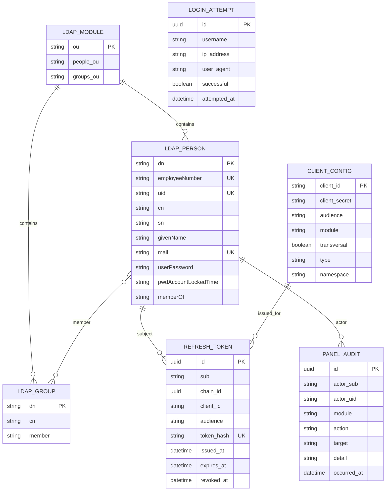

# Modelo de datos - LDAP, PostgreSQL y configuración

Versión corregida del diagrama ER publicado en Notion. Representa los datos que el backend realmente utiliza y distingue los tres orígenes: directorio LDAP, PostgreSQL y configuración `application.yml`.

Fuente original: [Diagramas UML (CU, ER) - Módulo 2](https://app.notion.com/p/drff/Diagramas-UML-CU-ER-Modulo-2-3c977c7e30048071b13dd90ecd96a45b?source=copy_link)

## Interpretación técnica

- `LDAP_MODULE`, `LDAP_PERSON` y `LDAP_GROUP` representan entradas del directorio, no tablas SQL.
- El módulo de una persona o grupo se deriva de su DN y de las OUs `People` y `Groups`; no existe un atributo LDAP `module` en los grupos.
- La membresía se guarda en `LDAP_GROUP.member`. `memberOf` en la persona es un atributo operacional mantenido por el overlay de OpenLDAP.
- `employeeNumber` tiene formato `U` seguido de seis dígitos y es el `sub` estable de los tokens humanos.
- `REFRESH_TOKEN.sub` referencia lógicamente a `LDAP_PERSON.employeeNumber`; no hay una clave foránea física entre LDAP y PostgreSQL.
- La revocación se representa mediante `revoked_at`, no mediante un booleano `revoked`.
- `LOGIN_ATTEMPT.username` puede corresponder a un usuario inexistente, porque también registra intentos fallidos; por eso no se dibuja una relación obligatoria con LDAP.
- `PANEL_AUDIT.actor_sub` conserva la identidad estable del actor, pero tampoco posee una clave foránea física contra LDAP.
- `CLIENT_CONFIG` no es una tabla: representa el registro de clientes cargado desde `application.yml`. Incluye clientes humanos y de servicio; `client_secret` y `namespace` solo aplican a servicios, mientras que `module` o `transversal` aplican a clientes humanos.
- Las tablas PostgreSQL reales son `refresh_tokens`, `login_attempts` y `panel_audit`.
