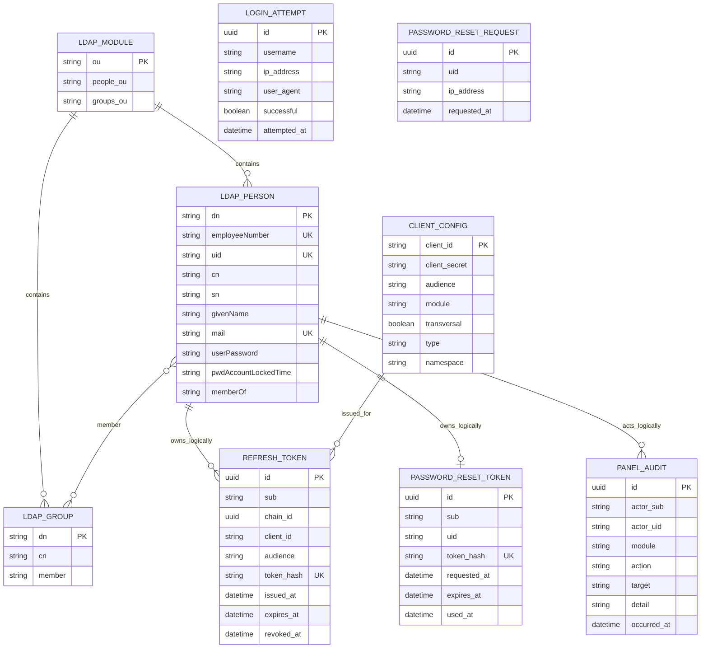

# Modelo entidad–relación — LDAP, PostgreSQL y configuración

**Módulo:** Login Federado e Identidad — Grupo 2  
**Fecha de revisión:** 24 de septiembre de 2026  
**Estado:** actualizado contra `schema.sql`, entidades JPA, estructura LDAP y configuración de clientes

Fuente original: [Diagramas UML (CU, ER) — Módulo 2](https://app.notion.com/p/drff/Diagramas-UML-CU-ER-Modulo-2-3c977c7e30048071b13dd90ecd96a45b?source=copy_link)

## 1. Alcance del modelo

El módulo utiliza tres orígenes de datos diferentes:

- **LDAP:** identidades, contraseñas, estado de cuenta, módulos y grupos.
- **PostgreSQL:** refresh tokens, intentos de login, auditoría y recuperación de contraseña.
- **Configuración:** registro de clientes humanos y de servicio cargado desde `application.yml` y variables de entorno.

Las relaciones entre distintos orígenes son lógicas. No existen claves foráneas físicas entre LDAP, PostgreSQL y la configuración.

## 2. Diagrama consolidado

## 3. Interpretación de las entidades

### Directorio LDAP

#### `LDAP_MODULE`

Representa cada unidad organizativa funcional. Los módulos vigentes son `movilidad`, `residuos`, `reclamos`, `emergencias`, `espacios`, `analitica` y `eda`. Cada módulo contiene las OUs `People` y `Groups`.

#### `LDAP_PERSON`

- `dn` identifica la entrada dentro del directorio.
- `employeeNumber` tiene formato `U` seguido de seis dígitos, es único globalmente y se utiliza como `sub` estable de los JWT humanos.
- `uid` es el username y puede cambiar; el backend repara las referencias de membresía después de un renombre.
- `mail` y `uid` son únicos a nivel global.
- `userPassword` es gestionado por LDAP y su política de contraseñas; el backend no persiste la contraseña en PostgreSQL.
- `pwdAccountLockedTime` representa la deshabilitación de la cuenta.
- `memberOf` es un atributo operacional mantenido por el overlay de OpenLDAP, no la fuente primaria de la relación.

#### `LDAP_GROUP`

- `cn` es único dentro de su módulo, no globalmente.
- `member` contiene DN de personas y constituye la fuente de la membresía.
- El módulo se deriva del DN y de la OU que contiene el grupo; no existe un atributo `module` persistido en la entrada.
- La API impide el anidamiento y limita cada persona a 50 grupos.

### PostgreSQL

#### `REFRESH_TOKEN`

- Conserva únicamente el hash SHA-256 del token opaco.
- `sub` referencia de manera lógica a `LDAP_PERSON.employeeNumber`.
- Todos los eslabones de una sesión comparten `chain_id`.
- `client_id` y `audience` permiten renovar para el mismo cliente y la misma API.
- `revoked_at` nulo significa token activo; no existe una columna booleana `revoked`.
- No almacena grupos, roles, correo ni contraseña. Los grupos se releen desde LDAP en cada renovación.

#### `LOGIN_ATTEMPT`

- Registra intentos exitosos y fallidos para el bloqueo por ventana deslizante.
- `username` no posee relación obligatoria con LDAP porque también se registran nombres inexistentes.
- Actualmente no existe una columna para persistir la decisión de anomalías `REVIEW`.

#### `PANEL_AUDIT`

- Registra el actor estable, username, módulo afectado, acción, destino, detalle y momento.
- `actor_sub` referencia lógicamente a una persona LDAP, pero no tiene clave foránea física.
- El actor podría cambiar de username o dejar de existir sin invalidar el registro histórico.
- La persistencia es de mejor esfuerzo: un error se registra en logs y no garantiza la reversión de la mutación LDAP.

#### `PASSWORD_RESET_TOKEN`

- Persiste únicamente el hash SHA-256 del token de recuperación.
- `sub` y `uid` identifican lógicamente a la cuenta LDAP.
- `used_at` nulo indica un token todavía no consumido; `expires_at` controla su vigencia.
- Al emitir un nuevo token se eliminan los tokens anteriores de la misma persona dentro de la misma transacción.
- El consumo utiliza una actualización condicional para impedir el doble canje concurrente.

#### `PASSWORD_RESET_REQUEST`

- Registra solicitudes aceptadas por el limitador para aplicar enfriamiento y topes por cuenta e IP.
- `uid` está normalizado, pero puede no corresponder a una persona existente; por eso no se dibuja una relación obligatoria con LDAP.
- Las solicitudes rechazadas por el limitador no generan una fila y reciben igualmente `204` hacia el cliente.

### Configuración

#### `CLIENT_CONFIG`

- No es una tabla: representa los clientes cargados desde configuración.
- Los clientes `human` utilizan `audience` y un `module`, excepto el cliente administrativo `transversal`.
- Los clientes `service` utilizan `client_secret`, audiencia `citypass` y un `namespace`; no representan personas ni contienen grupos.
- `client_id` vincula lógicamente un refresh token con el cliente humano que inició la sesión.

## 4. Cardinalidades y límites

| Relación | Cardinalidad | Interpretación |
| --- | --- | --- |
| Módulo–persona | 1 a 0..N | Cada persona pertenece a un módulo y cada módulo puede contener muchas personas. |
| Módulo–grupo | 1 a 0..N | Cada grupo pertenece a un módulo y cada módulo puede contener muchos grupos. |
| Persona–grupo | 0..N a 0..N | Una persona puede integrar varios grupos y un grupo puede contener varias personas. |
| Persona–refresh token | 1 a 0..N | Una persona puede tener varias sesiones y varios eslabones históricos por cadena. |
| Persona–token de recuperación | 1 a 0..1 | El servicio conserva como máximo una fila de recuperación por `sub`. |
| Persona–auditoría | 1 a 0..N | Una persona con rol administrativo puede producir múltiples registros históricos. |
| Cliente–refresh token | 1 a 0..N | Cada refresh token fue emitido para un cliente humano registrado. |

## 5. Relaciones deliberadamente no dibujadas

- `LOGIN_ATTEMPT.username` no es clave foránea porque deben registrarse intentos contra usuarios inexistentes.
- `PASSWORD_RESET_REQUEST.uid` no es clave foránea porque el endpoint aplica medidas anti-enumeración también a cuentas inexistentes.
- `PANEL_AUDIT.target` puede representar un DN, username, grupo u otro identificador; no referencia una única entidad.
- Los eventos EDA no son entidades persistidas en este esquema. El modo predeterminado los registra y el modo HTTP los envía al gateway.
- Los JWT no son entidades almacenadas. El access token es autosuficiente y se valida mediante la clave pública JWKS.
- El resultado del servicio de anomalías no se persiste actualmente como entidad propia.

## 6. Correcciones respecto del diagrama original

- Se reemplazó `revoked` por `revoked_at`, que es la columna real.
- Se agregó `chain_id`, `client_id`, `audience`, `issued_at` y el identificador estable `sub` al refresh token.
- Se agregaron `LOGIN_ATTEMPT`, `PANEL_AUDIT`, `PASSWORD_RESET_TOKEN` y `PASSWORD_RESET_REQUEST`.
- Se corrigió la falsa clave foránea física entre PostgreSQL y LDAP: la relación es lógica.
- Se eliminó el atributo inexistente `module` de `LDAP_GROUP`; el módulo se deriva del DN.
- Se incorporó la entidad conceptual `LDAP_MODULE` y la separación entre `People` y `Groups`.
- Se distinguieron clientes humanos y de servicio dentro de la configuración.
- Se documentó que `memberOf` es operacional y que la membresía primaria vive en `LDAP_GROUP.member`.
